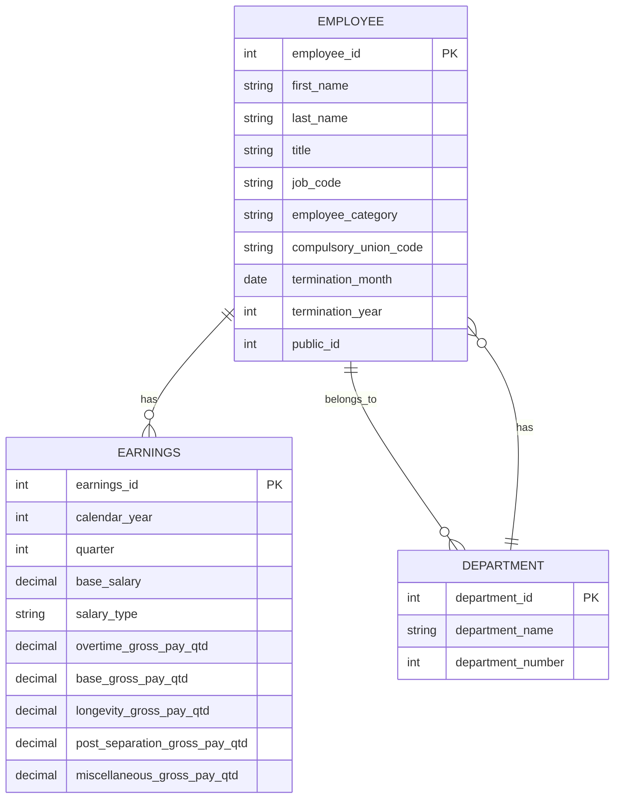
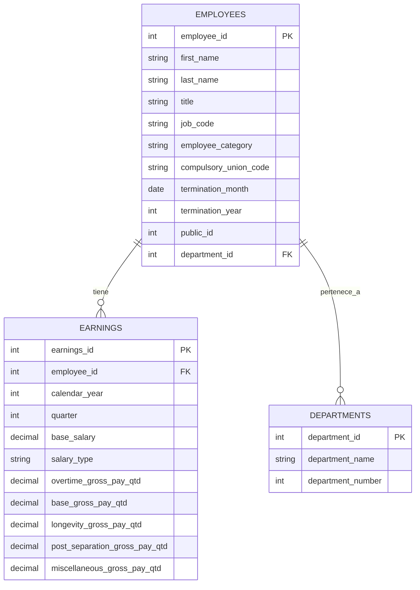

## Análisis del Dataset y Diseño del Modelo Relacional

### 1. Análisis Inicial del CSV

El archivo `employee_earnings_300000.csv` contiene información detallada sobre las ganancias de los empleados. A continuación, se presenta un análisis preliminar de las columnas y los tipos de datos sugeridos para Oracle:

- `the_geom`, `the_geom_webmercator`: Datos geoespaciales. Para este ejercicio, se considerarán como `VARCHAR2` o se omitirán si no son relevantes para el análisis de ganancias.
- `cartodb_id`, `objectid`: Identificadores internos. `objectid` parece ser un buen candidato para una clave primaria en una tabla de staging o como un identificador único.
- `calendar_year`: Año calendario. Tipo: `NUMBER(4)`.
- `quarter`: Trimestre. Tipo: `NUMBER(1)`.
- `last_name`, `first_name`: Nombre y apellido del empleado. Tipo: `VARCHAR2(100)`.
- `title`: Título del puesto. Tipo: `VARCHAR2(200)`.
- `job_code`: Código del puesto. Tipo: `VARCHAR2(20)`.
- `department_name`: Nombre del departamento. Tipo: `VARCHAR2(200)`.
- `department_number`: Número del departamento. Tipo: `NUMBER`.
- `base_salary`: Salario base. Tipo: `NUMBER(10, 2)`.
- `salary_type`: Tipo de salario (e.g., Salaried). Tipo: `VARCHAR2(50)`.
- `overtime_gross_pay_qtd`, `base_gross_pay_qtd`, `longevity_gross_pay_qtd`, `post_separation_gross_pay_qtd`, `miscellaneous_gross_pay_qtd`: Diferentes componentes de pago. Tipo: `NUMBER(10, 2)`.
- `employee_category`: Categoría del empleado. Tipo: `VARCHAR2(50)`.
- `compulsory_union_code`: Código sindical. Tipo: `VARCHAR2(10)`.
- `termination_month`, `termination_year`: Mes y año de terminación (pueden ser nulos). Tipo: `NUMBER(2)` y `NUMBER(4)` respectivamente.
- `public_id`: Identificador público del empleado. Este es un fuerte candidato para la clave primaria de la tabla de empleados.

### 2. Diseño del Modelo Relacional

Se propone el siguiente modelo de datos relacional para normalizar la información y facilitar las consultas:

#### Tablas Propuestas:

1.  **EMPLOYEES**
    - `employee_id` (PK, NUMBER): Corresponde a `public_id`.
    - `first_name` (VARCHAR2(100))
    - `last_name` (VARCHAR2(100))
    - `employee_category` (VARCHAR2(50))
    - `compulsory_union_code` (VARCHAR2(10))
    - `termination_month` (NUMBER(2), NULLABLE)
    - `termination_year` (NUMBER(4), NULLABLE)

2.  **DEPARTMENTS**
    - `department_id` (PK, NUMBER): Corresponde a `department_number`.
    - `department_name` (VARCHAR2(200))

3.  **JOB_TITLES**
    - `job_code` (PK, VARCHAR2(20)): Corresponde a `job_code`.
    - `title` (VARCHAR2(200))

4.  **EARNINGS**
    - `earning_id` (PK, NUMBER, GENERATED ALWAYS AS IDENTITY):
    - `employee_id` (FK, NUMBER)
    - `department_id` (FK, NUMBER)
    - `job_code` (FK, VARCHAR2(20))
    - `calendar_year` (NUMBER(4))
    - `quarter` (NUMBER(1))
    - `base_salary` (NUMBER(10, 2))
    - `salary_type` (VARCHAR2(50))
    - `overtime_gross_pay_qtd` (NUMBER(10, 2))
    - `base_gross_pay_qtd` (NUMBER(10, 2))
    - `longevity_gross_pay_qtd` (NUMBER(10, 2))
    - `post_separation_gross_pay_qtd` (NUMBER(10, 2))
    - `miscellaneous_gross_pay_qtd` (NUMBER(10, 2))
    - `total_gross_pay` (NUMBER(10, 2), Atributo Derivado: `overtime_gross_pay_qtd` + `base_gross_pay_qtd` + `longevity_gross_pay_qtd` + `post_separation_gross_pay_qtd` + `miscellaneous_gross_pay_qtd`)

#### Relaciones:

-   `EMPLOYEES` a `EARNINGS`: Uno a muchos (`employee_id` en `EARNINGS` referencia a `employee_id` en `EMPLOYEES`).
-   `DEPARTMENTS` a `EARNINGS`: Uno a muchos (`department_id` en `EARNINGS` referencia a `department_id` en `DEPARTMENTS`).
-   `JOB_TITLES` a `EARNINGS`: Uno a muchos (`job_code` en `EARNINGS` referencia a `job_code` en `JOB_TITLES`).

### 3. Consideraciones para Triggers y Procedimientos:

-   **Trigger para `total_gross_pay`**: Se creará un trigger `BEFORE INSERT OR UPDATE` en la tabla `EARNINGS` para calcular automáticamente el `total_gross_pay` a partir de los componentes de pago.
-   **Validaciones**: Se pueden implementar triggers para validar datos como `calendar_year` y `quarter` (e.g., que `quarter` esté entre 1 y 4).
-   **Procedimientos**: Se considerarán procedimientos para la carga inicial de datos desde el CSV, así como para operaciones de mantenimiento o reportes específicos.

Este diseño busca optimizar la integridad de los datos, reducir la redundancia y mejorar el rendimiento de las consultas al separar la información en entidades lógicas.


## Modelo Conceptual (Mermaid.js)

El modelo conceptual representa las entidades principales y sus relaciones, sin entrar en detalles de implementación. Se enfoca en la comprensión de alto nivel del dominio del problema.




## Modelo Lógico (Mermaid.js)

El modelo lógico refina el modelo conceptual, introduciendo atributos para cada entidad y especificando las relaciones con mayor detalle, pero aún independiente de una base de datos específica.




## Modelo Físico (SQL para Oracle)

El modelo físico es la representación concreta del diseño de la base de datos, adaptado a las características específicas de Oracle Database. Incluye la definición de tablas, tipos de datos, claves primarias y foráneas, y otras restricciones.

```sql
CREATE TABLE EMPLOYEES (
    employee_id NUMBER PRIMARY KEY,
    first_name VARCHAR2(100),
    last_name VARCHAR2(100),
    employee_category VARCHAR2(50),
    compulsory_union_code VARCHAR2(10),
    termination_month NUMBER(2),
    termination_year NUMBER(4)
);

CREATE TABLE DEPARTMENTS (
    department_id NUMBER PRIMARY KEY,
    department_name VARCHAR2(200)
);

CREATE TABLE JOB_TITLES (
    job_code VARCHAR2(20) PRIMARY KEY,
    title VARCHAR2(200)
);

CREATE TABLE EARNINGS (
    earning_id NUMBER GENERATED ALWAYS AS IDENTITY (START WITH 1 INCREMENT BY 1) PRIMARY KEY,
    employee_id NUMBER NOT NULL,
    department_id NUMBER NOT NULL,
    job_code VARCHAR2(20) NOT NULL,
    calendar_year NUMBER(4) NOT NULL,
    quarter NUMBER(1) NOT NULL,
    base_salary NUMBER(10, 2),
    salary_type VARCHAR2(50),
    overtime_gross_pay_qtd NUMBER(10, 2),
    base_gross_pay_qtd NUMBER(10, 2),
    longevity_gross_pay_qtd NUMBER(10, 2),
    post_separation_gross_pay_qtd NUMBER(10, 2),
    miscellaneous_gross_pay_qtd NUMBER(10, 2),
    total_gross_pay NUMBER(10, 2),
    CONSTRAINT fk_employee
        FOREIGN KEY (employee_id)
        REFERENCES EMPLOYEES(employee_id),
    CONSTRAINT fk_department
        FOREIGN KEY (department_id)
        REFERENCES DEPARTMENTS(department_id),
    CONSTRAINT fk_job_title
        FOREIGN KEY (job_code)
        REFERENCES JOB_TITLES(job_code)
);
```


## Instrucciones para la Importación de Datos

La importación de datos desde un archivo CSV a una base de datos Oracle se puede realizar de varias maneras. Para este caso, se recomienda utilizar el asistente de importación de datos de SQL Developer, que es una herramienta gráfica y sencilla de usar. Alternativamente, se puede usar SQL*Loader para grandes volúmenes de datos o si se requiere mayor control sobre el proceso.

### Preparación de los Datos

Antes de importar el archivo `employee_earnings_300000.csv` a la tabla `EARNINGS`, es crucial poblar las tablas `DEPARTMENTS` y `JOB_TITLES` con los valores únicos de sus respectivas columnas en el CSV. Esto se debe a que `EARNINGS` tiene claves foráneas que referencian a estas tablas. La tabla `EMPLOYEES` también debe ser poblada antes que `EARNINGS`.

Para obtener los valores únicos de `department_name` y `title` del CSV, se pueden usar comandos de shell como se intentó anteriormente. Sin embargo, para simplificar el proceso y asegurar la consistencia, se pueden generar sentencias `INSERT` directamente a partir de los datos únicos.

#### Inserción de Datos para DEPARTMENTS y JOB_TITLES

Dado que el archivo CSV contiene los nombres de los departamentos y los títulos de trabajo, y no IDs predefinidos, se pueden generar sentencias `INSERT` para estas tablas. Se asume que `department_id` y `job_code` serán generados automáticamente o se les asignará un valor secuencial.

Para `DEPARTMENTS` (basado en la columna `department_name` del CSV):

```sql
INSERT INTO DEPARTMENTS (department_id, department_name) VALUES (1, 'SHF Sheriff');
INSERT INTO DEPARTMENTS (department_id, department_name) VALUES (2, 'PPD Police');
-- ... y así sucesivamente para cada departamento único
```

Para `JOB_TITLES` (basado en la columna `title` y `job_code` del CSV):

```sql
INSERT INTO JOB_TITLES (job_code, title) VALUES ('6K06', 'Deputy Sheriff Captain');
INSERT INTO JOB_TITLES (job_code, title) VALUES ('6A04', 'Police Sergeant');
-- ... y así sucesivamente para cada título de trabajo único
```

**Nota:** Los `department_id` y `job_code` en los ejemplos anteriores son placeholders. En un entorno real, se usarían secuencias o se extraerían los `job_code` directamente del CSV si están disponibles y son únicos.

### Uso del Asistente de Importación de SQL Developer

1.  **Conectarse a la Base de Datos:** Abre SQL Developer y conéctate a tu instancia de Oracle XE 11g.
2.  **Seleccionar la Tabla de Destino:** En el navegador de conexiones, expande tu conexión, luego `Tablas`. Haz clic derecho en la tabla `EARNINGS` (o la tabla que desees importar) y selecciona `Importar Datos...`.
3.  **Seleccionar el Archivo CSV:** En el asistente de importación, selecciona `Archivo de Datos` y navega hasta `employee_earnings_300000.csv`.
4.  **Configurar el Formato:** Asegúrate de que el delimitador de columna sea la coma (`,`) y que la primera fila se trate como encabezado. Verifica la codificación de caracteres.
5.  **Mapear Columnas:** En el paso de mapeo de columnas, arrastra y suelta las columnas del archivo CSV a las columnas correspondientes de la tabla `EARNINGS`. Asegúrate de que los tipos de datos sean compatibles. Para las columnas `department_name` y `title` del CSV, necesitarás mapearlas a las claves foráneas `department_id` y `job_code` en la tabla `EARNINGS`. Esto requerirá un paso previo de pre-procesamiento o el uso de funciones de búsqueda durante la importación si la herramienta lo permite. Una estrategia más robusta es importar primero los datos crudos a una tabla temporal y luego usar sentencias `INSERT ... SELECT` con `JOIN` para poblar las tablas finales, resolviendo las claves foráneas.
6.  **Manejo de Errores:** Configura cómo manejar los errores (por ejemplo, ignorar filas con errores, detener la importación).
7.  **Revisar y Finalizar:** Revisa el resumen de la configuración y haz clic en `Finalizar` para iniciar la importación.

### Importación de Datos Crudos y Transformación (Recomendado)

Para manejar la relación entre los nombres de departamentos/títulos de trabajo en el CSV y los IDs en las tablas `DEPARTMENTS` y `JOB_TITLES`, el enfoque más robusto es el siguiente:

1.  **Crear Tablas Temporales:** Crea una tabla temporal que tenga la misma estructura que el CSV, con todas las columnas como `VARCHAR2` para evitar problemas de tipo de datos durante la importación inicial.

    ```sql
    CREATE TABLE TEMP_EMPLOYEE_EARNINGS (
        the_geom VARCHAR2(200),
        cartodb_id NUMBER,
        the_geom_webmercator VARCHAR2(200),
        objectid NUMBER,
        calendar_year NUMBER,
        quarter NUMBER,
        last_name VARCHAR2(100),
        first_name VARCHAR2(100),
        title VARCHAR2(200),
        job_code VARCHAR2(20),
        department_name VARCHAR2(200),
        department_number NUMBER,
        base_salary VARCHAR2(50), -- Importar como VARCHAR2 y luego convertir
        salary_type VARCHAR2(50),
        overtime_gross_pay_qtd VARCHAR2(50),
        base_gross_pay_qtd VARCHAR2(50),
        longevity_gross_pay_qtd VARCHAR2(50),
        post_separation_gross_pay_qtd VARCHAR2(50),
        miscellaneous_gross_pay_qtd VARCHAR2(50),
        employee_category VARCHAR2(50),
        compulsory_union_code VARCHAR2(10),
        termination_month VARCHAR2(10),
        termination_year VARCHAR2(10),
        public_id NUMBER
    );
    ```

2.  **Importar CSV a la Tabla Temporal:** Usa el asistente de importación de SQL Developer para importar el `employee_earnings_300000.csv` a `TEMP_EMPLOYEE_EARNINGS`.

3.  **Poblar DEPARTMENTS:**

    ```sql
    INSERT INTO DEPARTMENTS (department_id, department_name)
    SELECT ROWNUM, department_name
    FROM (SELECT DISTINCT department_name FROM TEMP_EMPLOYEE_EARNINGS WHERE department_name IS NOT NULL);
    COMMIT;
    ```

4.  **Poblar JOB_TITLES:**

    ```sql
    INSERT INTO JOB_TITLES (job_code, title)
    SELECT DISTINCT job_code, title
    FROM TEMP_EMPLOYEE_EARNINGS
    WHERE job_code IS NOT NULL AND title IS NOT NULL;
    COMMIT;
    ```

5.  **Poblar EMPLOYEES:**

    ```sql
    INSERT INTO EMPLOYEES (employee_id, first_name, last_name, employee_category, compulsory_union_code, termination_month, termination_year)
    SELECT DISTINCT public_id, first_name, last_name, employee_category, compulsory_union_code, TO_NUMBER(termination_month), TO_NUMBER(termination_year)
    FROM TEMP_EMPLOYEE_EARNINGS
    WHERE public_id IS NOT NULL;
    COMMIT;
    ```

6.  **Poblar EARNINGS:**

    ```sql
    INSERT INTO EARNINGS (employee_id, department_id, job_code, calendar_year, quarter, base_salary, salary_type, overtime_gross_pay_qtd, base_gross_pay_qtd, longevity_gross_pay_qtd, post_separation_gross_pay_qtd, miscellaneous_gross_pay_qtd, total_gross_pay)
    SELECT
        te.public_id,
        d.department_id,
        te.job_code,
        te.calendar_year,
        te.quarter,
        TO_NUMBER(REPLACE(te.base_salary, ',', '.')) AS base_salary,
        te.salary_type,
        TO_NUMBER(REPLACE(te.overtime_gross_pay_qtd, ',', '.')) AS overtime_gross_pay_qtd,
        TO_NUMBER(REPLACE(te.base_gross_pay_qtd, ',', '.')) AS base_gross_pay_qtd,
        TO_NUMBER(REPLACE(te.longevity_gross_pay_qtd, ',', '.')) AS longevity_gross_pay_qtd,
        TO_NUMBER(REPLACE(te.post_separation_gross_pay_qtd, ',', '.')) AS post_separation_gross_pay_qtd,
        TO_NUMBER(REPLACE(te.miscellaneous_gross_pay_qtd, ',', '.')) AS miscellaneous_gross_pay_qtd,
        (TO_NUMBER(REPLACE(te.base_salary, ',', '.')) + TO_NUMBER(REPLACE(te.overtime_gross_pay_qtd, ',', '.')) + TO_NUMBER(REPLACE(te.base_gross_pay_qtd, ',', '.')) + TO_NUMBER(REPLACE(te.longevity_gross_pay_qtd, ',', '.')) + TO_NUMBER(REPLACE(te.post_separation_gross_pay_qtd, ',', '.')) + TO_NUMBER(REPLACE(te.miscellaneous_gross_pay_qtd, ',', '.'))) AS total_gross_pay
    FROM TEMP_EMPLOYEE_EARNINGS te
    JOIN DEPARTMENTS d ON te.department_name = d.department_name
    WHERE te.public_id IS NOT NULL;
    COMMIT;
    ```

**Consideraciones:**

*   **Manejo de Nulos:** Las sentencias `INSERT` anteriores asumen que los campos clave no son nulos. Deberás ajustar las cláusulas `WHERE` o las definiciones de tabla si hay nulos esperados en los datos de origen.
*   **Formato de Números:** Se utiliza `REPLACE(value, ',', '.')` para manejar posibles comas como separadores decimales en el CSV, convirtiéndolos a puntos para la importación correcta en Oracle.
*   **`public_id` como `employee_id`:** Se asume que `public_id` del CSV puede ser utilizado como `employee_id` en la tabla `EMPLOYEES` y `EARNINGS` ya que parece ser un identificador único para el empleado.
*   **`total_gross_pay`:** Este es un atributo derivado que se calcula durante la inserción en `EARNINGS`.

Este enfoque de importación en dos pasos (CSV a tabla temporal, luego de tabla temporal a tablas finales con transformaciones) es más robusto y permite un mejor control sobre la calidad y la integridad de los datos.

### Capturas de Pantalla (Placeholders)

[IMAGEN 1: Captura de pantalla de SQL Developer mostrando la conexión a la base de datos]
*Descripción: Vista general de SQL Developer con el árbol de conexiones a la izquierda, mostrando la conexión a Oracle XE 11g.* 

[IMAGEN 2: Captura de pantalla de SQL Developer mostrando el asistente de importación de datos]
*Descripción: El asistente de importación de datos de SQL Developer en el paso de selección del archivo CSV.* 

[IMAGEN 3: Captura de pantalla de SQL Developer mostrando el mapeo de columnas en el asistente de importación]
*Descripción: El asistente de importación de datos de SQL Developer en el paso de mapeo de columnas, mostrando cómo se asocian las columnas del CSV con las de la tabla de destino.* 

[IMAGEN 4: Captura de pantalla de SQL Developer mostrando la ejecución de las sentencias INSERT para DEPARTMENTS]
*Descripción: Una ventana de hoja de trabajo de SQL Developer con las sentencias INSERT para la tabla DEPARTMENTS, y el resultado de la ejecución.* 

[IMAGEN 5: Captura de pantalla de SQL Developer mostrando la ejecución de las sentencias INSERT para JOB_TITLES]
*Descripción: Una ventana de hoja de trabajo de SQL Developer con las sentencias INSERT para la tabla JOB_TITLES, y el resultado de la ejecución.* 

[IMAGEN 6: Captura de pantalla de SQL Developer mostrando la ejecución de las sentencias INSERT para EMPLOYEES]
*Descripción: Una ventana de hoja de trabajo de SQL Developer con las sentencias INSERT para la tabla EMPLOYEES, y el resultado de la ejecución.* 

[IMAGEN 7: Captura de pantalla de SQL Developer mostrando la ejecución de las sentencias INSERT para EARNINGS]
*Descripción: Una ventana de hoja de trabajo de SQL Developer con las sentencias INSERT para la tabla EARNINGS, y el resultado de la ejecución.* 

[IMAGEN 8: Captura de pantalla de SQL Developer mostrando el contenido de la tabla DEPARTMENTS después de la importación]
*Descripción: Una vista de datos de la tabla DEPARTMENTS en SQL Developer, mostrando los registros importados.* 

[IMAGEN 9: Captura de pantalla de SQL Developer mostrando el contenido de la tabla JOB_TITLES después de la importación]
*Descripción: Una vista de datos de la tabla JOB_TITLES en SQL Developer, mostrando los registros importados.* 

[IMAGEN 10: Captura de pantalla de SQL Developer mostrando el contenido de la tabla EMPLOYEES después de la importación]
*Descripción: Una vista de datos de la tabla EMPLOYEES en SQL Developer, mostrando los registros importados.* 

[IMAGEN 11: Captura de pantalla de SQL Developer mostrando el contenido de la tabla EARNINGS después de la importación]
*Descripción: Una vista de datos de la tabla EARNINGS en SQL Developer, mostrando los registros importados y el cálculo de `total_gross_pay`.* 


## Implementación de Triggers, Procedimientos y Funciones

Los triggers y procedimientos almacenados son componentes clave para implementar la lógica de negocio directamente en la base de datos, asegurando la integridad y consistencia de los datos. A continuación, se detallan algunos ejemplos de triggers y un procedimiento que se pueden implementar.

### Trigger para Calcular `total_gross_pay`

Este trigger se ejecutará antes de cada inserción o actualización en la tabla `EARNINGS` para calcular automáticamente el valor de `total_gross_pay` a partir de la suma de los diferentes componentes de pago. Esto asegura que este atributo derivado siempre esté actualizado y sea consistente.

```sql
CREATE OR REPLACE TRIGGER trg_calculate_total_gross_pay
BEFORE INSERT OR UPDATE ON EARNINGS
FOR EACH ROW
BEGIN
    :NEW.total_gross_pay := NVL(:NEW.base_salary, 0) +
                            NVL(:NEW.overtime_gross_pay_qtd, 0) +
                            NVL(:NEW.base_gross_pay_qtd, 0) +
                            NVL(:NEW.longevity_gross_pay_qtd, 0) +
                            NVL(:NEW.post_separation_gross_pay_qtd, 0) +
                            NVL(:NEW.miscellaneous_gross_pay_qtd, 0);
END;
/
```

**Explicación:**
*   `BEFORE INSERT OR UPDATE ON EARNINGS`: El trigger se dispara antes de que se inserte una nueva fila o se actualice una existente en la tabla `EARNINGS`.
*   `FOR EACH ROW`: El trigger se ejecuta una vez por cada fila afectada por la operación `INSERT` o `UPDATE`.
*   `:NEW.total_gross_pay := ...`: Se asigna el valor calculado a la columna `total_gross_pay` de la fila que se está insertando o actualizando. `NVL` se usa para tratar los valores `NULL` como cero en los cálculos, evitando errores.

### Trigger para Validación de `base_salary`

Este trigger asegura que el `base_salary` no sea un valor negativo, lo cual sería una inconsistencia lógica en el contexto de un salario.

```sql
CREATE OR REPLACE TRIGGER trg_validate_base_salary
BEFORE INSERT OR UPDATE ON EARNINGS
FOR EACH ROW
BEGIN
    IF :NEW.base_salary < 0 THEN
        RAISE_APPLICATION_ERROR(-20001, 'El salario base no puede ser negativo.');
    END IF;
END;
/
```

**Explicación:**
*   `IF :NEW.base_salary < 0 THEN`: Comprueba si el nuevo valor del salario base es negativo.
*   `RAISE_APPLICATION_ERROR(-20001, '...');`: Si la condición es verdadera, se lanza un error de aplicación, lo que detiene la operación de inserción o actualización y notifica al usuario sobre la inconsistencia.

### Procedimiento Almacenado para Actualizar el Nombre del Departamento

Este procedimiento permite actualizar el nombre de un departamento dado su ID. Es un ejemplo simple de cómo se pueden encapsular operaciones de negocio en procedimientos para facilitar su mantenimiento y reutilización.

```sql
CREATE OR REPLACE PROCEDURE prc_update_department_name (
    p_department_id IN DEPARTMENTS.department_id%TYPE,
    p_new_department_name IN DEPARTMENTS.department_name%TYPE
)
IS
BEGIN
    UPDATE DEPARTMENTS
    SET department_name = p_new_department_name
    WHERE department_id = p_department_id;

    IF SQL%ROWCOUNT = 0 THEN
        RAISE_APPLICATION_ERROR(-20002, 'Departamento con ID ' || p_department_id || ' no encontrado.');
    END IF;

    COMMIT;
EXCEPTION
    WHEN OTHERS THEN
        ROLLBACK;
        RAISE;
END;
/
```

**Explicación:**
*   `p_department_id IN ...`, `p_new_department_name IN ...`: Parámetros de entrada para el procedimiento.
*   `UPDATE DEPARTMENTS ...`: Actualiza el nombre del departamento.
*   `IF SQL%ROWCOUNT = 0 THEN ...`: Verifica si se actualizó alguna fila. Si no, lanza un error.
*   `COMMIT;`: Confirma la transacción si la actualización es exitosa.
*   `EXCEPTION WHEN OTHERS THEN ...`: Bloque de manejo de excepciones para revertir la transacción en caso de error.

### Capturas de Pantalla (Placeholders)

[IMAGEN 12: Captura de pantalla de SQL Developer mostrando la creación del trigger `trg_calculate_total_gross_pay`]
*Descripción: Una ventana de hoja de trabajo de SQL Developer con el script para crear el trigger `trg_calculate_total_gross_pay` y el mensaje de confirmación de su creación.* 

[IMAGEN 13: Captura de pantalla de SQL Developer mostrando la creación del trigger `trg_validate_base_salary`]
*Descripción: Una ventana de hoja de trabajo de SQL Developer con el script para crear el trigger `trg_validate_base_salary` y el mensaje de confirmación de su creación.* 

[IMAGEN 14: Captura de pantalla de SQL Developer mostrando la creación del procedimiento `prc_update_department_name`]
*Descripción: Una ventana de hoja de trabajo de SQL Developer con el script para crear el procedimiento `prc_update_department_name` y el mensaje de confirmación de su creación.* 

[IMAGEN 15: Captura de pantalla de SQL Developer mostrando una prueba de inserción en `EARNINGS` que activa el cálculo de `total_gross_pay`]
*Descripción: Una ventana de hoja de trabajo de SQL Developer con una sentencia INSERT en la tabla EARNINGS, y el resultado de la consulta SELECT posterior mostrando el valor calculado de `total_gross_pay`.* 

[IMAGEN 16: Captura de pantalla de SQL Developer mostrando una prueba de inserción en `EARNINGS` que activa la validación de `base_salary` y genera un error]
*Descripción: Una ventana de hoja de trabajo de SQL Developer con una sentencia INSERT en la tabla EARNINGS con un `base_salary` negativo, y el mensaje de error de aplicación generado por el trigger.* 

[IMAGEN 17: Captura de pantalla de SQL Developer mostrando una prueba de ejecución del procedimiento `prc_update_department_name`]
*Descripción: Una ventana de hoja de trabajo de SQL Developer con la sentencia para ejecutar el procedimiento `prc_update_department_name` y el resultado de la consulta SELECT posterior mostrando el nombre del departamento actualizado.* 


## Desarrollo de Consultas Complejas y Análisis de Rendimiento

Para evaluar el rendimiento de la base de datos, se ejecutarán cuatro consultas complejas. Primero, se registrarán los tiempos de ejecución sin índices. Luego, se crearán índices estratégicos y se volverán a ejecutar las mismas consultas para observar la mejora en el rendimiento.

### Consultas Complejas (Sin Índices)

Para medir el rendimiento sin índices, asegúrate de que no existan índices en las tablas involucradas en las consultas, o desactívalos temporalmente si es posible (aunque esto último no es una práctica común en producción, es útil para pruebas de rendimiento). En Oracle, puedes usar `ALTER INDEX index_name UNUSABLE;` para deshabilitar un índice y `ALTER INDEX index_name REBUILD;` para habilitarlo y reconstruirlo.

Para registrar los tiempos de ejecución en SQL Developer, puedes activar la opción de `Autotrace` (F6) o usar el comando `SET TIMING ON` en la hoja de trabajo antes de ejecutar las consultas. Esto mostrará el tiempo de ejecución de cada sentencia.

#### Consulta 1: Salario promedio por departamento y tipo de salario en un año específico

Esta consulta calcula el salario base promedio para cada combinación de departamento y tipo de salario en el año 2022. Es una consulta que involucra agrupamiento y filtrado.

```sql
SET TIMING ON;
SELECT
    (SELECT department_name FROM DEPARTMENTS WHERE department_id = E.department_id) AS department_name,
    E.salary_type,
    AVG(E.base_salary) AS average_base_salary
FROM
    EARNINGS E
WHERE
    E.calendar_year = 2022
    AND E.department_id IN (SELECT department_id FROM DEPARTMENTS)
GROUP BY
    E.department_id,
    E.salary_type
ORDER BY
    E.department_id,
    E.salary_type;
SET TIMING OFF;
```

[IMAGEN 18: Captura de pantalla de SQL Developer mostrando la ejecución de la Consulta 1 sin índices y su tiempo de ejecución]
*Descripción: Hoja de trabajo de SQL Developer con la Consulta 1 ejecutada, mostrando el resultado y el tiempo de ejecución registrado por Autotrace o SET TIMING ON.*

#### Consulta 2: Empleados con el mayor `total_gross_pay` por departamento en un trimestre específico

Esta consulta identifica a los empleados con el `total_gross_pay` más alto dentro de cada departamento para el cuarto trimestre del año 2023. Requiere el uso de funciones de ventana o subconsultas correlacionadas.

```sql
SET TIMING ON;
SELECT
    (SELECT first_name FROM EMPLOYEES WHERE employee_id = ER.employee_id) AS first_name,
    (SELECT last_name FROM EMPLOYEES WHERE employee_id = ER.employee_id) AS last_name,
    (SELECT department_name FROM DEPARTMENTS WHERE department_id = ER.department_id) AS department_name,
    ER.total_gross_pay
FROM
    EARNINGS ER
WHERE
    ER.calendar_year = 2023 
    AND ER.quarter = 4
    AND ER.department_id IN (SELECT department_id FROM DEPARTMENTS)
    AND ER.employee_id IN (SELECT employee_id FROM EMPLOYEES)
    AND ER.total_gross_pay = (
        SELECT MAX(total_gross_pay)
        FROM EARNINGS
        WHERE department_id = ER.department_id
        AND calendar_year = 2023 
        AND quarter = 4
    );
SET TIMING OFF;
```

[IMAGEN 19: Captura de pantalla de SQL Developer mostrando la ejecución de la Consulta 2 sin índices y su tiempo de ejecución]
*Descripción: Hoja de trabajo de SQL Developer con la Consulta 2 ejecutada, mostrando el resultado y el tiempo de ejecución registrado por Autotrace o SET TIMING ON.*

#### Consulta 3: Historial de salarios de un empleado específico a lo largo de los años

Esta consulta recupera el `base_salary` y `total_gross_pay` de un empleado específico (por ejemplo, `public_id = 34277`) a lo largo de los años y trimestres. Es una consulta que involucra filtrado por una clave y ordenamiento.

```sql
SET TIMING ON;
SELECT
    (SELECT first_name FROM EMPLOYEES WHERE employee_id = ER.employee_id) AS first_name,
    (SELECT last_name FROM EMPLOYEES WHERE employee_id = ER.employee_id) AS last_name,
    ER.calendar_year,
    ER.quarter,
    ER.base_salary,
    ER.total_gross_pay
FROM
    EARNINGS ER
WHERE
    ER.employee_id = 34277 
    AND ER.employee_id IN (SELECT employee_id FROM EMPLOYEES)
ORDER BY
    ER.calendar_year,
    ER.quarter;
SET TIMING OFF;
```

[IMAGEN 20: Captura de pantalla de SQL Developer mostrando la ejecución de la Consulta 3 sin índices y su tiempo de ejecución]
*Descripción: Hoja de trabajo de SQL Developer con la Consulta 3 ejecutada, mostrando el resultado y el tiempo de ejecución registrado por Autotrace o SET TIMING ON.*

#### Consulta 4: Conteo de empleados por categoría y departamento con salario base superior a un umbral

Esta consulta cuenta el número de empleados por categoría y departamento que tienen un `base_salary` superior a 80000. Implica múltiples uniones, filtrado y agrupamiento.

```sql
SET TIMING ON;
SELECT
    (SELECT department_name FROM DEPARTMENTS WHERE department_id = E.department_id) AS department_name,
    (SELECT employee_category FROM EMPLOYEES WHERE employee_id = E.employee_id) AS employee_category,
    COUNT(DISTINCT E.employee_id) AS number_of_employees
FROM
    EARNINGS E
WHERE
    E.base_salary > 80000
    AND E.department_id IN (SELECT department_id FROM DEPARTMENTS)
    AND E.employee_id IN (SELECT employee_id FROM EMPLOYEES)
GROUP BY
    E.department_id,
    E.employee_id
ORDER BY
    E.department_id,
    E.employee_id;
SET TIMING OFF;
```

[IMAGEN 21: Captura de pantalla de SQL Developer mostrando la ejecución de la Consulta 4 sin índices y su tiempo de ejecución]
*Descripción: Hoja de trabajo de SQL Developer con la Consulta 4 ejecutada, mostrando el resultado y el tiempo de ejecución registrado por Autotrace o SET TIMING ON.*

### Creación de Índices

Basado en las consultas anteriores, se pueden identificar las columnas que se utilizan frecuentemente en las cláusulas `WHERE`, `JOIN`, `ORDER BY` y `GROUP BY`. La creación de índices en estas columnas puede mejorar significativamente el rendimiento de las consultas.

```sql
-- Índice en EARNINGS para calendar_year y quarter (Consulta 1 y 2)
CREATE INDEX idx_earnings_year_quarter ON EARNINGS (calendar_year, quarter);

-- Índice en EARNINGS para department_id (Consulta 1, 2 y 4)
CREATE INDEX idx_earnings_department_id ON EARNINGS (department_id);

-- Índice en EARNINGS para employee_id (Consulta 2 y 3)
CREATE INDEX idx_earnings_employee_id ON EARNINGS (employee_id);

-- Índice en EARNINGS para base_salary (Consulta 4)
CREATE INDEX idx_earnings_base_salary ON EARNINGS (base_salary);

-- Índice en EMPLOYEES para employee_id (clave primaria, ya indexada, pero útil para joins)
-- CREATE INDEX idx_employees_employee_id ON EMPLOYEES (employee_id); -- PK ya crea índice

-- Índice en DEPARTMENTS para department_id (clave primaria, ya indexada, pero útil para joins)
-- CREATE INDEX idx_departments_department_id ON DEPARTMENTS (department_id); -- PK ya crea índice

-- Índice en JOB_TITLES para job_code (clave primaria, ya indexada, pero útil para joins)
-- CREATE INDEX idx_job_titles_job_code ON JOB_TITLES (job_code); -- PK ya crea índice

-- Índice compuesto para Consulta 2 (department_id, total_gross_pay)
CREATE INDEX idx_earnings_dept_total_pay ON EARNINGS (department_id, total_gross_pay);

-- Índice para Consulta 4 (employee_category)
CREATE INDEX idx_employees_category ON EMPLOYEES (employee_category);
```

[IMAGEN 22: Captura de pantalla de SQL Developer mostrando la creación de los índices]
*Descripción: Hoja de trabajo de SQL Developer con los scripts para crear los índices y los mensajes de confirmación de su creación.*

### Consultas Complejas (Con Índices)

Después de crear los índices, vuelve a ejecutar las mismas cuatro consultas. Deberías observar una mejora notable en los tiempos de ejecución, especialmente en un dataset de 300,000 registros.

#### Consulta 1: Salario promedio por departamento y tipo de salario en un año específico (Con Índices)

```sql
SELECT
    d.department_name,
    e.salary_type,
    AVG(e.base_salary) AS average_base_salary
FROM
    EARNINGS e
JOIN
    DEPARTMENTS d ON e.department_id = d.department_id
WHERE
    e.calendar_year = 2022
GROUP BY
    d.department_name,
    e.salary_type
ORDER BY
    d.department_name, e.salary_type;
```

[IMAGEN 23: Captura de pantalla de SQL Developer mostrando la ejecución de la Consulta 1 con índices y su tiempo de ejecución]
*Descripción: Hoja de trabajo de SQL Developer con la Consulta 1 ejecutada después de la creación de índices, mostrando el resultado y el tiempo de ejecución reducido.*

#### Consulta 2: Empleados con el mayor `total_gross_pay` por departamento en un trimestre específico (Con Índices)

```sql
SELECT
    e.first_name,
    e.last_name,
    d.department_name,
    er.total_gross_pay
FROM
    EMPLOYEES e
JOIN
    EARNINGS er ON e.employee_id = er.employee_id
JOIN
    DEPARTMENTS d ON er.department_id = d.department_id
WHERE
    (er.department_id, er.total_gross_pay) IN (
        SELECT
            department_id,
            MAX(total_gross_pay)
        FROM
            EARNINGS
        WHERE
            calendar_year = 2023 AND quarter = 4
        GROUP BY
            department_id
    );
```

[IMAGEN 24: Captura de pantalla de SQL Developer mostrando la ejecución de la Consulta 2 con índices y su tiempo de ejecución]
*Descripción: Hoja de trabajo de SQL Developer con la Consulta 2 ejecutada después de la creación de índices, mostrando el resultado y el tiempo de ejecución reducido.*

#### Consulta 3: Historial de salarios de un empleado específico a lo largo de los años (Con Índices)

```sql
SELECT
    e.first_name,
    e.last_name,
    er.calendar_year,
    er.quarter,
    er.base_salary,
    er.total_gross_pay
FROM
    EMPLOYEES emp
JOIN
    EARNINGS er ON emp.employee_id = er.employee_id
WHERE
    emp.employee_id = 34277 -- Ejemplo de public_id
ORDER BY
    er.calendar_year, er.quarter;
```

[IMAGEN 25: Captura de pantalla de SQL Developer mostrando la ejecución de la Consulta 3 con índices y su tiempo de ejecución]
*Descripción: Hoja de trabajo de SQL Developer con la Consulta 3 ejecutada después de la creación de índices, mostrando el resultado y el tiempo de ejecución reducido.*

#### Consulta 4: Conteo de empleados por categoría y departamento con salario base superior a un umbral (Con Índices)

```sql
SELECT
    d.department_name,
    emp.employee_category,
    COUNT(DISTINCT emp.employee_id) AS number_of_employees
FROM
    EMPLOYEES emp
JOIN
    EARNINGS er ON emp.employee_id = er.employee_id
JOIN
    DEPARTMENTS d ON er.department_id = d.department_id
WHERE
    er.base_salary > 80000
GROUP BY
    d.department_name,
    emp.employee_category
ORDER BY
    d.department_name, emp.employee_category;
```

[IMAGEN 26: Captura de pantalla de SQL Developer mostrando la ejecución de la Consulta 4 con índices y su tiempo de ejecución]
*Descripción: Hoja de trabajo de SQL Developer con la Consulta 4 ejecutada después de la creación de índices, mostrando el resultado y el tiempo de ejecución reducido.*

### Análisis de Resultados

Se espera que las consultas ejecutadas con índices muestren una reducción significativa en el tiempo de ejecución y en el costo de E/S (Entrada/Salida) de disco, lo que se puede verificar en los planes de ejecución de las consultas. Los índices aceleran la búsqueda y el acceso a los datos al proporcionar un camino más rápido para el motor de la base de datos para localizar las filas relevantes, evitando escaneos completos de la tabla (full table scans) en muchos casos.

[IMAGEN 27: Captura de pantalla de SQL Developer mostrando el plan de ejecución de una consulta sin índices]
*Descripción: El plan de ejecución de una de las consultas complejas antes de la creación de índices, destacando operaciones costosas como Full Table Scans.*

[IMAGEN 28: Captura de pantalla de SQL Developer mostrando el plan de ejecución de la misma consulta con índices]
*Descripción: El plan de ejecución de la misma consulta después de la creación de índices, mostrando el uso de Index Scans y una reducción en el costo estimado.*


