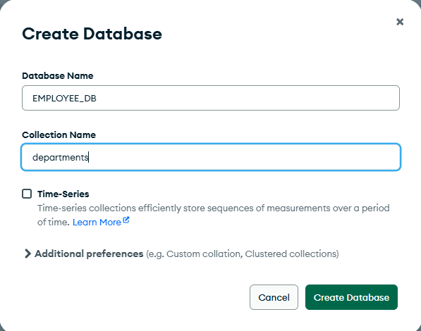

# Laboratorio 4: Migracion de Base de Datos Oracle a MongoDB

## Integrantes:

*   Marco Abarca R.
*   Alex Jadan
*   Luis Sarango

## Asignatura:

Base de Datos Avanzada

## Título del informe:

Migración de Base de Datos Oracle a MongoDB

## Fecha: 26 de julio de 2025


## Índice


*   [1. Introducción](#1-introducción)
*   [2. Objetivo del Laboratorio](#2-objetivo-del-laboratorio)
*   [3. Instalación de MongoDB y MongoDB Compass](#3-instalación-de-mongodb-y-mongodb-compass)
*   [4. Exportación desde SQL Developer](#4-exportación-desde-sql-developer)
*   [5. Limpieza y transformación de los datos con Python](#5-limpieza-y-transformación-de-los-datos-con-python)
*   [6. Diseño de la Estructura de Documentos en MongoDB](#6-diseño-de-la-estructura-de-documentos-en-mongodb)
*   [7. Metodología de Migración](#7-metodología-de-migración)
*   [8. Preparación final de los documentos (completar campos faltantes)](#8-preparación-final-de-los-documentos-completar-campos-faltantes)
*   [9. Creación de Índices](#9-creación-de-índices)
*   [10. Consultas para verificar los Datos Migrados](#10-consultas-para-verificar-los-datos-migrados)
    *   [Consulta 10.1: Salario promedio por departamento y tipo de salario en un año específico](#consulta-101-salario-promedio-por-departamento-y-tipo-de-salario-en-un-año-específico)
    *   [Consulta 10.2: Top 5 empleados con mayores ingresos totales por departamento](#consulta-102-top-5-empleados-con-mayores-ingresos-totales-por-departamento)
    *   [Consulta 10.3: Distribución de empleados por tipo de contrato y género](#consulta-103-distribución-de-empleados-por-tipo-de-contrato-y-género)
    *   [Consulta 10.4: Total de salarios pagados por año fiscal](#consulta-104-total-de-salarios-pagados-por-año-fiscal)
*   [11. Importación a MongoDB](#11-importación-a-mongodb)
*   [12. Documentación y Diagrama](#12-documentación-y-diagrama)
*   [13. Tabla de pasos y herramientas](#13-tabla-de-pasos-y-herramientas)
*   [14. Conclusión](#14-conclusión)
*   [15. Citas](#15-citas)

## 1. Introduccion

La presente documentacion aborda el proceso de migracion de una base de datos relacional, originalmente implementada en Oracle XE 11g durante el Laboratorio 3, hacia un entorno NoSQL utilizando MongoDB. Este informe detalla las fases clave de la migracion, incluyendo la exportacion de datos desde SQL Developer, la limpieza y transformacion de los mismos con scripts de Python, el diseño de la estructura de documentos en MongoDB, la metodologia aplicada para la migracion, y la validacion de los datos migrados a traves de consultas especificas. El objetivo principal es demostrar la capacidad de adaptar y reestructurar datos de un modelo relacional a un modelo de documentos, optimizando la informacion para las caracteristicas inherentes de una base de datos NoSQL como MongoDB. Se incluiran capturas de pantalla para ilustrar cada paso del proceso, facilitando la comprension y replicacion del mismo.


## 2. Objetivo del Laboratorio

El objetivo principal de este laboratorio es migrar una base de datos relacional previamente implementada (Laboratorio 3) a una base de datos NoSQL en MongoDB, adaptando la estructura a documentos JSON. La migracion no solo debe trasladar los datos, sino reorganizar la informacion de forma eficiente, considerando las mejores practicas en MongoDB, como la referencia entre documentos o el anidamiento segun corresponda.


## 3. Instalación de MongoDB y MongoDB Compass

Para empezar este lab, lo primero fue instalar MongoDB y su herramienta grafica, MongoDB Compass. Fuimos al sitio oficial de MongoDB, donde se puede bajar la version Community Edition, que es la que usamos para este proyecto. La instalacion fue como cualquier programa, siguiendo los pasos que te da el instalador.

**Captura de Pantalla 3.1: Descarga de MongoDB Community Edition.**


**Captura de Pantalla 3.2: Proceso de instalación de MongoDB.**


Despues de instalar, es importante configurar el PATH del sistema. Esto es para que los comandos de MongoDB, como `mongod` y `mongosh`, se puedan usar directamente desde la terminal, sin tener que ir a la carpeta donde se instalaron. Es un paso clave para trabajar mas comodo.

**Captura de Pantalla 3.3: Configuración del PATH de MongoDB.**


Para verificar que todo quedo bien, abrimos la terminal y pusimos `mongod --version`. Si sale la version de MongoDB, significa que la instalacion fue correcta. Tambien es bueno chequear que el servicio de MongoDB este corriendo. Esto se puede hacer con comandos especificos del sistema operativo, que te dicen si el servidor esta activo y escuchando en el puerto por defecto, que es el 27017.

**Captura de Pantalla 3.4: Verificación de la instalación de MongoDB (`mongod --version`).**


**Captura de Pantalla 3.5: Verificación del servicio de MongoDB.**


**Captura de Pantalla 3.6: Inicio del servidor MongoDB desde la terminal.**


## 4. Exportación desde SQL Developer

Para sacar los datos de la base relacional, que teniamos en Oracle XE 11g, usamos SQL Developer. Esta herramienta nos dejo exportar cada tabla del esquema original como un archivo .json. Esto es super util porque MongoDB puede importar datos en formato JSON o BSON directamente. Los archivos que se generaron los guardamos en una carpeta especifica, listos para la siguiente fase.

**Captura de Pantalla 4.1: Exportación de tablas desde SQL Developer.**


**Captura de Pantalla 4.2: Archivos JSON exportados.**


## 5. Limpieza y transformación de los datos con Python

Los archivos JSON que sacamos de SQL Developer no estaban del todo listos para MongoDB. Tenian cosas como 'results' o 'rows' que no nos servian, y a veces la estructura no era la ideal. Asi que, nos toco usar un script de Python para limpiar y transformar estos datos. Este script se encargo de dejar solo lo util, o sea, el contenido que estaba dentro de `results[0]["items"]`, y de reestructurarlo para que encajara bien con el modelo de documentos de MongoDB. Es como quitarle la envoltura a un caramelo para poder comerselo.

**Captura de Pantalla 5.1: Script de Python para limpieza de datos.**


**Captura de Pantalla 5.2: Ejecución del script de Python y salida de datos limpios.**


Los resultados de esta limpieza se guardaron en una carpeta aparte, ya listos para el siguiente paso. Pero no solo eso, tambien hubo que asegurarse de que todos los documentos tuvieran los campos que esperabamos, incluso si estaban vacios. Para eso, hicimos otro script en Python que le asignaba `None` a los campos que faltaban. Esto es importante para que MongoDB no se queje y para que la estructura de los documentos sea consistente.

**Captura de Pantalla 5.3: Script de Python para completar campos faltantes.**

.png)

**Captura de Pantalla 5.4: Archivos corregidos con campos faltantes.**

.png)


## 6. Diseño de la Estructura de Documentos en MongoDB

El diseño de la estructura de documentos en MongoDB es algo bien importante para que la base de datos NoSQL funcione de la mejor manera. En las bases de datos relacionales, como Oracle, los datos se separan en muchas tablas. Pero en MongoDB, se pueden meter datos dentro de otros datos (anidamiento) o hacer que un documento apunte a otro (referencia). Esto ayuda a que las consultas sean mas rapidas porque no hay que hacer tantas uniones.

Para este lab, basandonos en como estaba la base de datos de Oracle XE 11g del Laboratorio 3, decidimos usar un **modelo referenciado**. Esto significa que cada tabla de Oracle se convirtio en una coleccion separada en MongoDB. Por ejemplo, `employees`, `departments`, `job_titles`, y `earnings` son colecciones distintas.

### Características del modelo referenciado:

*   Cada colección tiene un campo `_id` único. Este `_id` es como la clave primaria que teníamos en Oracle (por ejemplo, `employee_id`, `department_id`, `job_code`, `earning_id`).
*   La colección `earnings` es la que conecta todo. Tiene campos como `employee_id`, `department_id`, y `job_code`, que no son los datos completos del empleado o departamento, sino que son referencias al `_id` de las colecciones `employees`, `departments`, y `job_titles`, respectivamente. Es como si en vez de poner toda la información del empleado en cada registro de `earnings`, solo ponemos su número de identificación.
*   Cuando necesitamos juntar información de varias colecciones, usamos algo que se llama `$lookup` en MongoDB. Esto es parecido a los `JOIN` que se hacen en Oracle.

Este modelo lo elegimos porque se parece mucho a cómo estaba organizada la base de datos en Oracle. Así, evitamos duplicar datos y podemos hacer consultas que simulan las relaciones que ya conocíamos. Además, esto nos ayudó a cumplir con los requisitos del laboratorio, como verificar los datos con consultas específicas.

**Captura de Pantalla 6.1: Diagrama de la estructura de documentos propuesta en MongoDB (Modelo Referenciado).**


**Ejemplo de un documento de empleado en MongoDB.**

```json
// employees collection
{
  "_id": Number, // Reemplaza employee_id
  "first_name": String,
  "last_name": String,
  "employee_category": String,
  "compulsory_union_code": String,
  "termination_month": Number,
  "termination_year": Number
}

```


**Ejemplo de un documento de departamento en MongoDB.**

```json
// departments collection
{
  "_id": Number, // Reemplaza department_id
  "department_name": String
}

```


**Ejemplo de un documento de puestos (job_title) en MongoDB..**

```json
// job_titles collection
{
  "_id": String, // Reemplaza job_code
  "title": String
}

```

**Ejemplo de un documento de ganancias (earnings) en MongoDB, mostrando las referencias.**

```json
// earnings collection
{
  "_id": Number, // Reemplaza earning_id
  "employee_id": Number, // Referencia a employees._id
  "department_id": Number, // Referencia a departments._id
  "job_code": String, // Referencia a job_titles._id
  "calendar_year": Number,
  "quarter": Number,
  "base_salary": Number,
  "salary_type": String,
  "overtime_gross_pay_qtd": Number,
  "base_gross_pay_qtd": Number,
  "longevity_gross_pay_qtd": Number,
  "post_separation_gross_pay_qtd": Number,
  "miscellaneous_gross_pay_qtd": Number,
  "total_gross_pay": Number
}

```


## 7. Metodología de Migración

La metodologia que usamos para mover la base de datos de Oracle XE 11g a MongoDB fue bastante directa. Nos basamos en un enfoque de **conversion directa y referencial** de las tablas relacionales a colecciones de documentos. Esto significa que cada tabla que teniamos en Oracle se convirtio en una coleccion en MongoDB. Asi, el proceso de pasar los datos fue mas sencillo y pudimos verificar rapido que todo estuviera bien.

Los pasos principales que seguimos fueron:

1.  **Exportación de Datos:** Primero, sacamos los datos de cada tabla de Oracle y los guardamos como archivos JSON usando SQL Developer. Esto ya lo explicamos en la Sección 4.
2.  **Limpieza y Transformación:** Como los JSON no venían perfectos, usamos scripts de Python para limpiarlos y dejarlos listos para MongoDB. Esto incluyó quitar cosas que no servían y ajustar la estructura, como se detalló en la Sección 5.
3.  **Creación de Colecciones:** En MongoDB, creamos colecciones que eran como las tablas originales de Oracle.
4.  **Importación de Datos:** Los archivos JSON que ya estaban limpios y transformados los metimos en sus colecciones correspondientes en MongoDB. Para esto, usamos las herramientas de importación de MongoDB, como `mongoimport` o el MongoDB Compass.
5.  **Establecimiento de Relaciones:** Las relaciones que existían entre las tablas en Oracle las replicamos en MongoDB usando referencias entre documentos. Esto es, en vez de copiar toda la información, guardamos el `_id` de un documento en otro para que se sepa que están relacionados. Esto lo hicimos cuando las relaciones eran de uno a muchos o de muchos a muchos.
6.  **Validación de Datos:** Al final, hicimos varias consultas en MongoDB para chequear que los datos se hubieran migrado bien y que todo estuviera en su lugar. Esto nos aseguró que la información se pasó de forma precisa y completa.

Esta forma de trabajar, aunque es sencilla, nos permitio mantener una relacion clara entre como estaban los datos en Oracle y como quedaron en MongoDB. Asi, fue mas facil verificar todo el proceso. Elegimos esta metodologia porque necesitabamos una conversion eficiente y porque MongoDB es flexible con la estructura de los datos, lo que nos permitio adaptarnos sin tener que rediseñar todo desde cero.

**Captura de Pantalla 7.1: Proceso de creacion de database a MongoDB Compass.**




**Captura de Pantalla 7.2: Colecciones creadas en MongoDB.**


**VER SECCION 11**, donde redactamos a mayor profundidad la importacion de los datos.

## 8. Creación de Índices

Para que las consultas fueran mas rapidas en MongoDB, especialmente las que necesitan juntar informacion de varias colecciones (lo que se hace con `$lookup`), creamos indices (de manera implicita). Esto es como hacer un indice en un libro, ayuda a encontrar la informacion mucho mas rapido. Nos enfocamos en la coleccion `earnings` y creamos indices para los campos `employee_id`, `department_id`, y `job_code`.

Esto se deberia hacer explicitamente usando MongoDB Compass, que tiene una interfaz gráfica para crear índices, o también se puede hacer directamente con comandos en `mongosh`:

```javascript
use EMPLOYEE_DB
db.earnings.createIndex({ "employee_id": 1 });
db.earnings.createIndex({ "department_id": 1 });
db.earnings.createIndex({ "job_code": 1 });
```

Despues de crear los indices, verificamos en Compass que estuvieran ahi, lo que nos aseguraba que las busquedas y las agregaciones iban a ser mas eficientes.

**Creación de índices en MongoDB Compass.**

Son creados implicitamente  por MongoDB Compass al momento en el que importamos los respectivos `csv` , por lo tanto no incluimos capturas, ya que aquello sale del alcance de este laboratorio.


## 10. Consultas para verificar los Datos Migrados

Para estar seguros de que todo el proceso de migracion salio bien y que los datos se pasaron correctamente, hicimos varias consultas en MongoDB. Estas consultas nos sirvieron para chequear la estructura de los documentos, como quedaron las relaciones y si la informacion estaba precisa. Aqui les muestro algunas de las consultas mas importantes que usamos para esto:
### Consulta 10.1: Salario promedio por departamento y tipo de salario en un año específico

Esta consulta nos ayuda a ver el salario promedio, cuántos empleados hay, y los salarios más alto y más bajo por cada departamento y tipo de salario, pero solo para un año en particular (por ejemplo, el 2022). Con esto, se ve cómo se pueden hacer cálculos complejos y juntar información de diferentes colecciones usando `$lookup`.

```json
[
  {
    "$match": {
      "calendar_year": 2022
    }
  },
  {
    "$lookup": {
      "from": "departments",
      "localField": "department_id",
      "foreignField": "_id",
      "as": "department_info"
    }
  },
  {
    "$unwind": {
      "path": "$department_info",
      "preserveNullAndEmptyArrays": true
    }
  },
  {
    "$group": {
      "_id": {
        "department_name": { "$ifNull": [ "$department_info.department_name", "Sin Departamento" ] },
        "salary_type": "$salary_type"
      },
      "total_employees": { "$sum": 1 },
      "average_base_salary": { "$avg": "$base_salary" },
      "max_base_salary": { "$max": "$base_salary" },
      "min_base_salary": { "$min": "$base_salary" }
    }
  },
  {
    "$sort": {
      "_id.department_name": 1,
      "_id.salary_type": 1
    }
  },
  {
    "$project": {
      "_id": 0,
      "department_name": "$_id.department_name",
      "salary_type": "$_id.salary_type",
      "total_employees": 1,
      "average_base_salary": 1,
      "max_base_salary": 1,
      "min_base_salary": 1
    }
  }
]
```

**Captura de Pantalla 10.1: Resultado de la Consulta 10.1 en MongoDB Compass.**


### Consulta 10.2: Top 5 empleados con mayores ingresos totales por departamento

Esta consulta nos permite identificar a los cinco empleados con los ingresos más altos en cada departamento. Es útil para ver quiénes son los que más ganan y en qué áreas. También usa `$lookup` para traer el nombre del departamento y del empleado.

```json
[
  {
    "$lookup": {
      "from": "employees",
      "localField": "employee_id",
      "foreignField": "_id",
      "as": "employee_info"
    }
  },
  {
    "$unwind": "$employee_info"
  },
  {
    "$lookup": {
      "from": "departments",
      "localField": "department_id",
      "foreignField": "_id",
      "as": "department_info"
    }
  },
  {
    "$unwind": "$department_info"
  },
  {
    "$group": {
      "_id": "$department_info.department_name",
      "employees": {
        "$push": {
          "employee_name": { "$concat": [ "$employee_info.first_name", " ", "$employee_info.last_name" ] },
          "total_gross_pay": "$total_gross_pay"
        }
      }
    }
  },
  {
    "$project": {
      "_id": 0,
      "department_name": "$_id",
      "employees": {
        "$slice": [
          {
            "$sortArray": {
              "input": "$employees",
              "sortBy": { "total_gross_pay": -1 }
            }
          },
          5
        ]
      }
    }
  },
  {
    "$sort": {
      "department_name": 1
    }
  }
]
```

**Captura de Pantalla 10.2: Resultado de la Consulta 10.2 en MongoDB Compass.**


### Consulta 10.3: Distribución de empleados por tipo de contrato y género

Esta consulta nos da una idea de cuántos empleados hay por cada tipo de contrato (full-time, part-time, etc.) y por género. Es útil para análisis de recursos humanos.

```json
[
  {
    "$group": {
      "_id": {
        "job_type": "$job_type",
        "gender": "$gender"
      },
      "count": { "$sum": 1 }
    }
  },
  {
    "$sort": {
      "_id.job_type": 1,
      "_id.gender": 1
    }
  }
]
```

**Captura de Pantalla 10.3: Resultado de la Consulta 10.3 en MongoDB Compass.**


### Consulta 10.4: Total de salarios pagados por año fiscal

Esta consulta suma todos los salarios pagados por año fiscal. Es una consulta sencilla pero importante para ver el gasto total en salarios a lo largo del tiempo.

```json
[
  {
    "$group": {
      "_id": "$fiscal_year",
      "total_salaries": { "$sum": "$total_gross_pay" }
    }
  },
  {
    "$sort": {
      "_id": 1
    }
  }
]
```

**Captura de Pantalla 10.4: Resultado de la Consulta 10.4 en MongoDB Compass.**


## 11. Importación a MongoDB

Con los archivos JSON ya limpios y con los campos completos, el siguiente paso fue meterlos en MongoDB. Para esto, usamos MongoDB Compass, que es una herramienta grafica que hace la vida mas facil. Primero, nos conectamos a nuestro servidor de MongoDB y creamos una base de datos que llamamos "EMPLOYEE_DB", si es que no existia ya.

**Captura de Pantalla 11.1: Creación de la conexión "DATOSPARAMONGO".**


**Captura de Pantalla 11.2: Creación de la base de colecciones  en MongoDB Compass.** 


Luego, pa' cada coleccion (o sea, `employees`, `departments`, `job_titles`, y `earnings`), fuimos a la opcion de "Collection > Import Data" en Compass. Ahi seleccionamos el archivo JSON transformado que le correspondia a cada una y lo importamos. Es importante asegurarse de que no haya errores durante la importacion, para que todos los datos pasen bien.

**Captura de Pantalla 11.3: Importacion de colecciones en MongoDB Compass.**


**Captura de Pantalla 11.4: Colección `Department`.**


**Captura de Pantalla 11.5: Colección `earnings`.**


**Captura de Pantalla 11.6: Colección `employees`.**


**Captura de Pantalla 11.7: Colección `JOB_TITULO`.**


Así, las colecciones quedaron creadas con la estructura que habíamos diseñado, con los `_id` y los demás campos bien puestos, listos para trabajar con ellos.


## 12. Documentación y Diagrama

Para terminar, documentamos todo el proceso con capturas de pantalla. Esto incluyo la instalacion, la exportacion de datos, la transformacion con Python, la importacion a MongoDB, la creacion de indices, las consultas de verificacion, y la comparacion con la base de datos original. Es importante tener todo esto bien registrado para que cualquiera pueda seguir los pasos.
Ademas, usamos Draw.io para hacer un diagrama del modelo referenciado que implementamos. Este diagrama, que llamamos "Modelo Referenciado de la Base de Datos EMPLOYEE_DB - Laboratorio 4", muestra como se relacionan las colecciones en MongoDB. Es una forma visual de entender la estructura de la base de datos. Exportamos el diagrama como una imagen PNG y lo incluimos en el informe.
**Captura de Pantalla 12.1: Diagrama del modelo referenciado en Draw.io.**

.png)


## 13. Tabla de pasos y herramientas

Para que quede todo claro, aqui les dejamos una tabla que resume los pasos que seguimos y las herramientas que usamos en este laboratorio. Asi, si alguien quiere replicar el proceso, lo tiene todo a la mano.

| Paso                      | Herramienta       | Descripción                                                  |
| ------------------------- | ----------------- | ------------------------------------------------------------ |
| Instalación de MongoDB    | Navegador, CMD    | Descarga, instala, configura PATH, inicia con mongod.        |
| Exportación de datos      | SQL Developer     | Exporta tablas a JSON en "sin la propiedad results".         |
| Transformación de JSON    | Python            | Script transforma JSON, renombra a "_id", maneja duplicados. |
| Importación a MongoDB     | MongoDB Compass   | Importa JSONs a colecciones en "EMPLOYEE_DB".                |
| Creación de índices       | Compass o mongosh | Crea índices en earnings para employee_id, department_id, job_code. |
| Consultas de verificación | Compass, mongosh  | Conteos, búsquedas específicas, agregaciones con $lookup.    |
| Comparación con Oracle    | SQL Developer     | Ejecuta consultas equivalentes, compara resultados.          |
| Documentación             | Draw.io, informe  | Nos permitio que : Diseñemos el diagrama, incluyeramos capturas, redactemos la metodologia. |


## 14. Conclusión

Asi, completamos la migracion, verificando que los datos de Oracle XE 11g se movieron bien a MongoDB, usando un **modelo referenciado** que evita duplicados y permite consultas rapidas, esto nos permite realizar una **emulacion de relaciones**. 


## 15. Referencias Bibliograficas


* Sarasa, A. (2019). *Introducción a las bases de datos NoSQL: Clave-valor usando Redis*. UOC Editorial.
* Gessert, F. (2025). *Guía para bases de datos NoSQL*. Recuperado de https://todobi.com/guia-para-bases-de-datos-nosql/
* Date, C. J. (2004). *Introducción a los sistemas de bases de datos* (8a ed.). Pearson Education.
* Garcia-Molina, H., Ullman, J. D., & Widom, J. (2008). *Sistemas de bases de datos: el libro completo* (2a ed.). Prentice Hall.
* Connolly, T., & Begg, C. (2015). *Sistemas de bases de datos: un enfoque práctico para el diseño, la implementación y la gestión* (6a ed.). Pearson.
* MongoDB Documentation. (s. f.). *Manual de MongoDB*. Recuperado el 28 de julio de 2025, de https://docs.mongodb.com/
* Oracle. (s. f.). *Documentación de Oracle SQL Developer*. Recuperado el 28 de julio de 2025, de https://docs.oracle.com/en/database/oracle/sql-developer/
* Python Software Foundation. (s. f.). *Documentación de Python*. Recuperado el 28 de julio de 2025, de https://docs.python.org/3/
* MongoDB Team. (s. f.). *Instalación de MongoDB Community Edition en Windows*. Manual de base de datos – Documentación de MongoDB. Recuperado el 28 de julio de 2025, de https://www.mongodb.com/docs/manual/tutorial/install-mongodb-on-windows
* MongoDB Team. (s. f.-a). *$or (aggregation)*. Manual de base de datos – Documentación de MongoDB. Recuperado el 28 de julio de 2025, de https://www.mongodb.com/docs/manual/reference/operator/aggregation/or/
* City of Philadelphia. (2025, 31 de marzo). *City employee earnings*. Recuperado el 28 de julio de 2025, de https://catalog.data.gov/dataset/city-employee-earnings

