# Documentación del Procedimiento: Implementación de Base de Datos Oracle XE 11g con SQL Developer

## Integrantes

* Marco Abarca R.
* Alex Jadan
* Luis Sarango


## Índice

- [Introducción](#introducción)
- [1. Análisis del Dataset y Diseño del Modelo Relacional](#1-análisis-del-dataset-y-diseño-del-modelo-relacional)
- [2. Creación de Modelos y Scripts SQL](#2-creación-de-modelos-y-scripts-sql)
  - [Modelo Conceptual](#modelo-conceptual)
  - [Modelo Lógico](#modelo-lógico)
  - [Modelo Físico](#modelo-físico)
- [3. Importación de Datos CSV](#3-importación-de-datos-csv)
- [4. Implementación de Triggers, Procedimientos y Funciones](#4-implementación-de-triggers-procedimientos-y-funciones)
  - [Trigger para Cálculo de `total_gross_pay`](#trigger-para-cálculo-de-total_gross_pay)
  - [Trigger para Validación de `base_salary`](#trigger-para-validación-de-base_salary)
  - [Procedimiento para Actualizar Nombre de Departamento](#procedimiento-para-actualizar-nombre-de-departamento)
- [5. Desarrollo de Consultas Complejas y Análisis de Rendimiento](#5-desarrollo-de-consultas-complejas-y-análisis-de-rendimiento)
  - [Consultas sin Índices](#consultas-sin-índices)
    - [Consulta 1: Salario promedio por departamento y tipo de salario en un año específico](#consulta-1-salario-promedio-por-departamento-y-tipo-de-salario-en-un-año-específico)
    - [Consulta 2: Empleados con el mayor `total_gross_pay` por departamento en un trimestre específico](#consulta-2-empleados-con-el-mayor-total_gross_pay-por-departamento-en-un-trimestre-específico)
    - [Consulta 3: Historial de salarios de un empleado específico a lo largo de los años](#consulta-3-historial-de-salarios-de-un-empleado-específico-a-lo-largo-de-los-años)
    - [Consulta 4: Conteo de empleados por categoría y departamento con salario base superior a un umbral](#consulta-4-conteo-de-empleados-por-categoría-y-departamento-con-salario-base-superior-a-un-umbral)
  - [Creación de Índices](#creación-de-índices)
  - [Consultas con Índices](#consultas-con-índices)
    - [Consulta 1: Salario promedio por departamento y tipo de salario en un año específico (Con Índices)](#consulta-1-salario-promedio-por-departamento-y-tipo-de-salario-en-un-año-específico-con-índices)
    - [Consulta 2: Empleados con el mayor `total_gross_pay` por departamento en un trimestre específico (Con Índices)](#consulta-2-empleados-con-el-mayor-total_gross_pay-por-departamento-en-un-trimestre-específico-con-índices)
    - [Consulta 3: Historial de salarios de un empleado específico a lo largo de los años (Con Índices)](#consulta-3-historial-de-salarios-de-un-empleado-específico-a-lo-largo-de-los-años-con-índices)
    - [Consulta 4: Conteo de empleados por categoría y departamento con salario base superior a un umbral (Con Índices)](#consulta-4-conteo-de-empleados-por-categoría-y-departamento-con-salario-base-superior-a-un-umbral-con-índices)
  - [Análisis de Resultados de Rendimiento](#análisis-de-resultados-de-rendimiento)
- [Conclusión](#conclusión)
- [Referencias Biográficas y Contexto Histórico](#referencias-biográficas-y-contexto-histórico)
  - [Edgar F. Codd: El Padre del Modelo Relacional](#edgar-f-codd-el-padre-del-modelo-relacional)
  - [Los Creadores de SQL: Chamberlin y Boyce](#los-creadores-de-sql-chamberlin-y-boyce)
  - [Los Fundadores de Oracle: Ellison, Miner y Oates](#los-fundadores-de-oracle-ellison-miner-y-oates)
  - [Referencias](#referencias)

## Introducción

Este documento detalla el proceso de diseño, implementación y optimización de una base de datos en Oracle XE 11g utilizando SQL Developer, a partir de un conjunto de datos proporcionado en formato CSV. El objetivo es construir un modelo de datos relacional robusto, importar eficientemente los datos, e incorporar lógica de negocio mediante triggers y procedimientos almacenados. Además, se analizará el rendimiento de consultas complejas, con y sin la aplicación de índices, para demostrar su impacto en la eficiencia de la base de datos.

La información aquí presentada busca ser una guía clara y concisa, permitiendo una comprensión rápida de los pasos clave y las decisiones tomadas durante el desarrollo. Se incluyen marcadores para capturas de pantalla que complementarán visualmente cada etapa del proceso.

## 1. Análisis del Dataset y Diseño del Modelo Relacional

El primer paso crucial fue comprender la estructura del archivo  que escojimos: `employee_earnings_300000.csv`. Este dataset contiene una gran cantidad de registros relacionados con las ganancias de empleados, incluyendo información sobre su identidad, departamento, puesto de trabajo y diversos componentes salariales. La inspección inicial reveló la necesidad de normalizar los datos para evitar redundancias y asegurar la integridad referencial.

Se identificaron las siguientes entidades principales:

*   **EMPLOYEES**: Para almacenar la información básica de cada empleado.
*   **DEPARTMENTS**: Para los nombres y números de los departamentos.
*   **JOB_TITLES**: Para los códigos y títulos de los puestos de trabajo.
*   **EARNINGS**: Para los registros de ganancias de los empleados, que incluyen detalles salariales por año y trimestre.

La relación entre estas entidades es fundamental. Un empleado pertenece a un departamento y ocupa un puesto de trabajo. Los registros de ganancias están directamente asociados a un empleado, y a su vez, a un departamento y un puesto de trabajo, lo que permite un análisis detallado de las remuneraciones.


*Descripción: Vista de las primeras filas del archivo CSV, mostrando las columnas y el formato de los datos.* 

## 2. Creación de Modelos y Scripts SQL

El diseño de la base de datos se articuló a través de modelos conceptual, lógico y físico. Estos modelos sirvieron como planos para la construcción de la base de datos, asegurando una estructura coherente y optimizada.

### Modelo Conceptual

Representa las entidades y sus relaciones a un alto nivel, enfocándose en el 'qué' del negocio. Aquí se definieron las entidades `EMPLOYEE`, `DEPARTMENT`, `JOB_TITLE` y `EARNINGS` y sus interconexiones básicas.

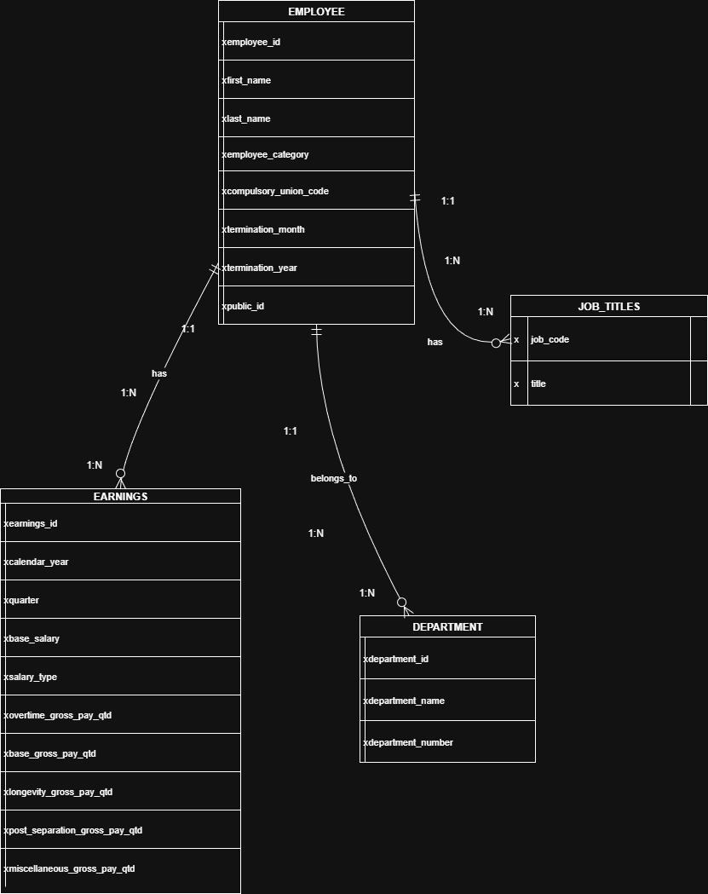
*Descripción: Diagrama que ilustra las entidades principales y sus relaciones generales.* 

### Modelo Lógico

Este modelo refina el conceptual, añadiendo atributos específicos a cada entidad y detallando las relaciones, pero aún de forma independiente de la tecnología de base de datos. Se definieron las claves primarias y foráneas lógicas.

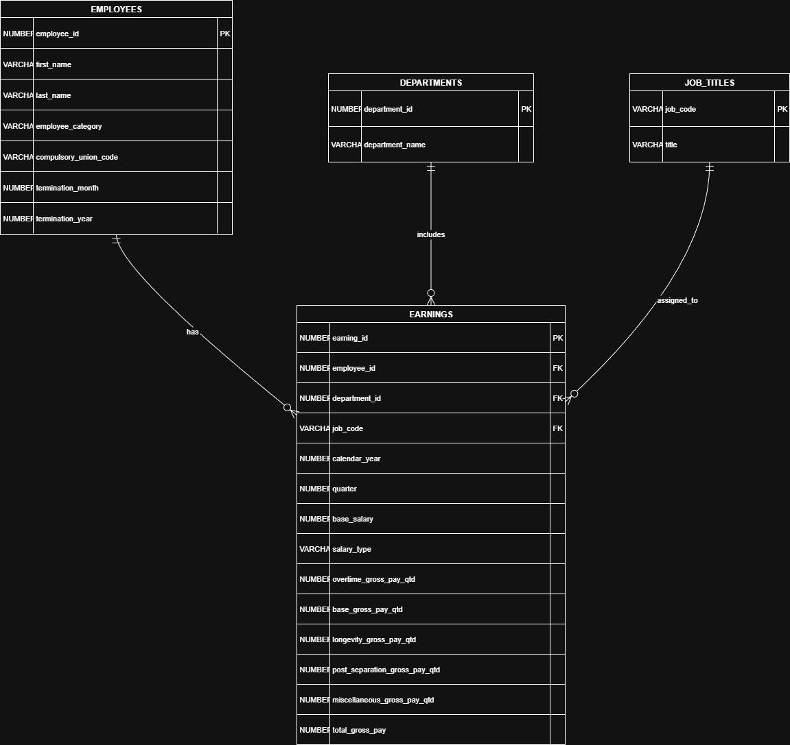
*Descripción: Diagrama que muestra las entidades con sus atributos y las relaciones detalladas.* 

### Modelo Físico

El modelo físico es la implementación concreta para Oracle XE 11g. Se tradujeron las entidades y atributos a tablas y columnas SQL, especificando tipos de datos, restricciones de integridad (claves primarias, foráneas, `NOT NULL`) y la definición de secuencias para IDs autoincrementales. Los scripts SQL para la creación de estas tablas se generaron cuidadosamente para asegurar la compatibilidad y eficiencia con Oracle.

```sql
CREATE TABLE EMPLOYEES (
    employee_id NUMBER PRIMARY KEY,
    first_name VARCHAR2(100),
    last_name VARCHAR2(100),
    employee_category VARCHAR2(50),
    compulsory_union_code VARCHAR2(10),
    termination_month NUMBER(2),
    termination_year NUMBER(4)
);

CREATE TABLE DEPARTMENTS (
    department_id NUMBER PRIMARY KEY,
    department_name VARCHAR2(200)
);

CREATE TABLE JOB_TITLES (
    job_code VARCHAR2(20) PRIMARY KEY,
    title VARCHAR2(200)
);

CREATE TABLE EARNINGS (
    earning_id NUMBER PRIMARY KEY,
    employee_id NUMBER NOT NULL,
    department_id NUMBER NOT NULL,
    job_code VARCHAR2(20) NOT NULL,
    calendar_year NUMBER(4) NOT NULL,
    quarter NUMBER(1) NOT NULL,
    base_salary NUMBER(10, 2),
    salary_type VARCHAR2(50),
    overtime_gross_pay_qtd NUMBER(10, 2),
    base_gross_pay_qtd NUMBER(10, 2),
    longevity_gross_pay_qtd NUMBER(10, 2),
    post_separation_gross_pay_qtd NUMBER(10, 2),
    miscellaneous_gross_pay_qtd NUMBER(10, 2),
    total_gross_pay NUMBER(10, 2),
    CONSTRAINT fk_employee
        FOREIGN KEY (employee_id)
        REFERENCES EMPLOYEES(employee_id),
    CONSTRAINT fk_department
        FOREIGN KEY (department_id)
        REFERENCES DEPARTMENTS(department_id),
    CONSTRAINT fk_job_title
        FOREIGN KEY (job_code)
        REFERENCES JOB_TITLES(job_code)
);

CREATE SEQUENCE earnings_seq
START WITH 1
INCREMENT BY 1
NOCACHE
NOCYCLE;

CREATE OR REPLACE TRIGGER earnings_before_insert -- trigger de control
BEFORE INSERT ON EARNINGS
FOR EACH ROW
BEGIN
    IF :NEW.earning_id IS NULL THEN
        SELECT earnings_seq.NEXTVAL
        INTO :NEW.earning_id
        FROM dual;
    END IF;
END;


```


*Descripción: Creación de la Tabla `DEPARTMENTS`*

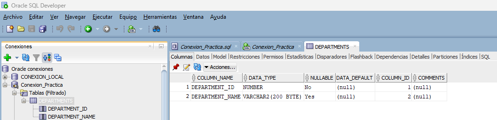

*Descripción: Propiedades de la Tabla `DEPARTMENTS`*

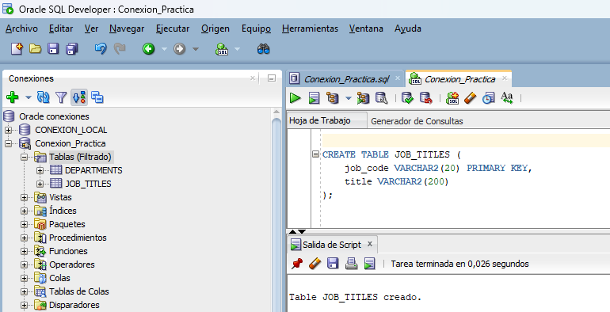

*Descripción: Creación de la Tabla `JOB_TITLES`*

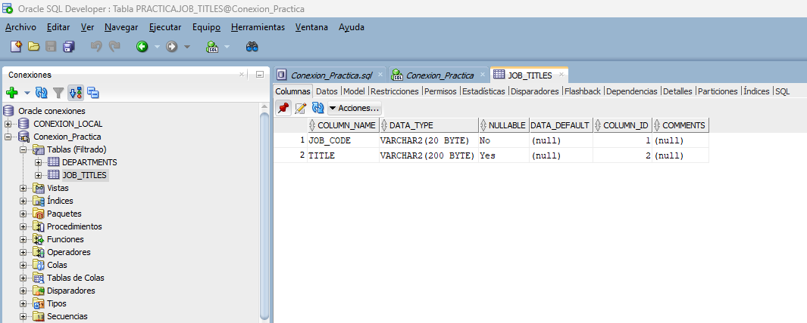

*Descripción: Propiedades de la Tabla `JOB_TITLES`*


*Descripción: Creacion de la Tabla `EMPLEADOS`*

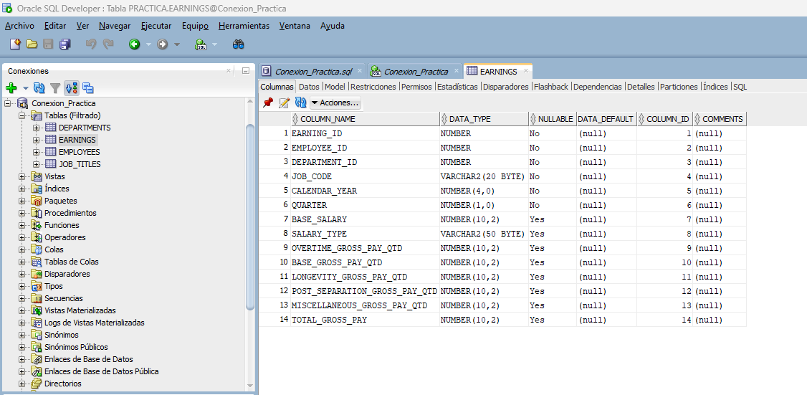

*Descripción: Propiedades de la Tabla `EARNINGS`*

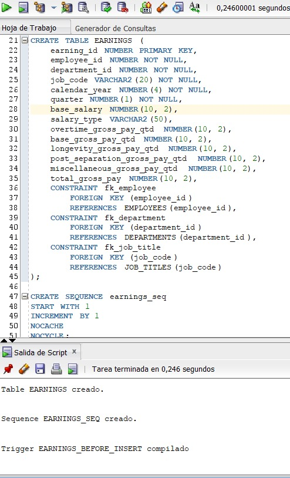

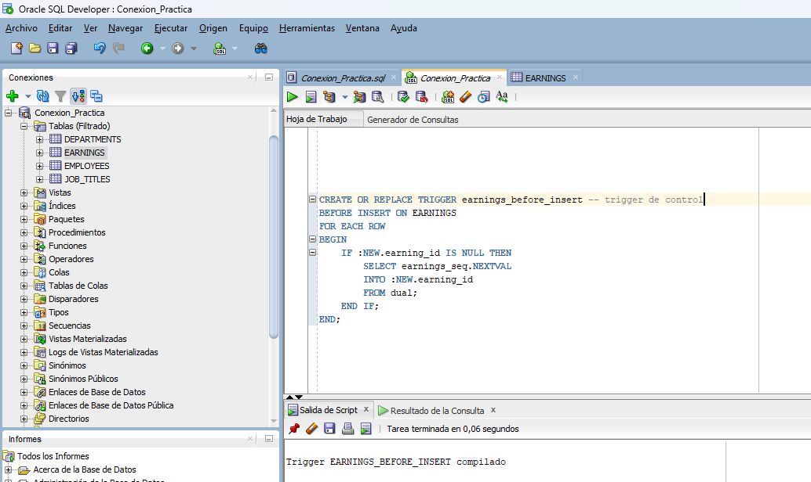


*Descripción: Creacion de la Tabla `EARNINGS`*

***Descripción General: Fragmento del script SQL con las sentencias `CREATE TABLE` para las tablas `EMPLOYEES`, `DEPARTMENTS`, `JOB_TITLES` y `EARNINGS`.*** 

## 3. Importación de Datos CSV

La importación de 300,000 registros desde el CSV a la estructura relacional diseñada fue un paso crítico. Se optó por un enfoque en dos fases para manejar las dependencias de claves foráneas y asegurar la correcta normalización de los datos:

1.  **Carga a una Tabla Temporal de Respaldo (Como metodo de fallback):** Primero, el CSV completo se importó a una tabla temporal (`TEMP_EMPLOYEE_EARNINGS`) con todas las columnas definidas como `VARCHAR2`. Esto minimizó los problemas de tipo de datos durante la carga inicial.

​		

*Descripción: Script SQL para la creación de la tabla `TEMP_EMPLOYEE_EARNINGS`.* 


*Descripción: Proceso de importación del CSV a `TEMP_EMPLOYEE_EARNINGS` usando el asistente de SQL Developer.* 

2. **Limpiar el Dataset Completo:**

   * Usamos pandas, una libreria rica en el manejo de datos en python para limpiar el csv y enlistarlo para ser importado hacia nuestra base de datos :

   ```python
   import pandas as pd
   
   # 1️⃣ Cargar el CSV original
   df = pd.read_csv('employee_earnings_300000.csv')
   
   # 2️⃣ Calcular 'total_gross_pay' como columna derivada para earnings
   df['total_gross_pay'] = (
       df['base_salary'].fillna(0) +
       df['overtime_gross_pay_qtd'].fillna(0) +
       df['base_gross_pay_qtd'].fillna(0) +
       df['longevity_gross_pay_qtd'].fillna(0) +
       df['post_separation_gross_pay_qtd'].fillna(0) +
       df['miscellaneous_gross_pay_qtd'].fillna(0)
   )
   
   # --------------- DEPARTMENTS ---------------
   cols_departments = ['department_number', 'department_name']
   df_departments = df[cols_departments].drop_duplicates(subset=['department_number'])
   df_departments = df_departments.rename(columns={'department_number': 'department_id'})
   df_departments.to_csv('departments.csv', index=False)
   
   # --------------- JOB_TITLES ---------------
   cols_job_titles = ['job_code', 'title']
   df_job_titles = df[cols_job_titles].drop_duplicates(subset=['job_code'])
   df_job_titles.to_csv('job_titles.csv', index=False)
   
   # --------------- EMPLOYEES ---------------
   cols_employees = ['public_id', 'first_name', 'last_name', 'employee_category',
                     'compulsory_union_code', 'termination_month', 'termination_year']
   df_employees = df[cols_employees].drop_duplicates(subset=['public_id'])
   df_employees = df_employees.rename(columns={'public_id': 'employee_id'})
   df_employees.to_csv('employees.csv', index=False)
   
   # --------------- EARNINGS ---------------
   cols_earnings = ['public_id', 'department_number', 'job_code', 'calendar_year', 'quarter',
                    'base_salary', 'salary_type', 'overtime_gross_pay_qtd',
                    'base_gross_pay_qtd', 'longevity_gross_pay_qtd',
                    'post_separation_gross_pay_qtd', 'miscellaneous_gross_pay_qtd',
                    'total_gross_pay']
   
   df_earnings = df[cols_earnings].copy()
   df_earnings = df_earnings.rename(columns={
       'public_id': 'employee_id',
       'department_number': 'department_id'
   })
   # Aquí, si deseas eliminar duplicados exactos en earnings (opcional):
   # df_earnings = df_earnings.drop_duplicates()
   
   df_earnings.to_csv('earnings.csv', index=False)
   
   # Mensajes de confirmación
   print("✅ Archivos limpios y separados generados exitosamente:")
   print("- departments.csv")
   print("- job_titles.csv")
   print("- employees.csv")
   print("- earnings.csv")
   
   
   ```


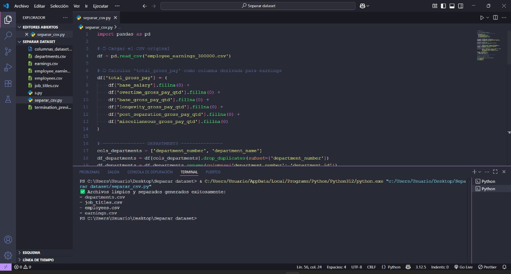

*Descripción: Proceso de limpieza del CSV inicial a  4 archivos resultantes: `departments.csv`, `job_titles.csv`, `employees.csv` y `earnings.csv` usando la libreria pandas de Python.* 


3. **Transformación y Carga a Tablas Finales:** Como metodo de fallback importariamos los datos desde la tabla temporal, utilizando sentencias `INSERT INTO ... SELECT FROM` para poblar las tablas `DEPARTMENTS`, `JOB_TITLES`, `EMPLOYEES` y `EARNINGS`. Sin embargo, importamos los archivos `csv` limpios con nuestro script de `python` como metodo principal. Este método permitió extraer los valores únicos para `DEPARTMENTS` y `JOB_TITLES`, y resolver las claves foráneas sin mayor dificultad. Además, se realizaron conversiones de tipo de datos y cálculos de atributos derivados (como `total_gross_pay`) durante este proceso.


*Descripción: Visualizacion de un trigger de control para la tabla `EARNINGS` antes de la importación, mostrando la omision de valores nulos antes de la importacion. Evitando asi futuros conflictos* 


*Descripción: Sentencias `INSERT INTO ... SELECT DISTINCT` para poblar las tablas `DEPARTMENTS` y `JOB_TITLES`.* 


*Descripción: Sentencias `INSERT INTO ... SELECT` para poblar las tablas `EMPLOYEES` y `EARNINGS`, incluyendo el paso a la prueba lógica para `total_gross_pay` (un atributo derivado, que se calculo transparentemente, gracias a nuestro trigger definido en la subsecuente seccion .* 


## 4. Implementación de Triggers, Procedimientos y Funciones

Para asegurar la integridad de los datos y automatizar ciertas tareas, se implementaron triggers y procedimientos almacenados. Estas piezas de lógica de base de datos son esenciales para mantener la consistencia y aplicar reglas de negocio directamente en el motor de la base de datos.

### Trigger para Cálculo de `total_gross_pay`

Se creó un trigger `trg_calculate_total_gross_pay` que se activa antes de cada inserción o actualización en la tabla `EARNINGS`. Su función es calcular automáticamente el `total_gross_pay` sumando los diversos componentes de pago (`base_salary`, `overtime_gross_pay_qtd`, etc.). Esto garantiza que este campo derivado siempre refleje la suma correcta de los ingresos, sin necesidad de que la aplicación cliente lo calcule.

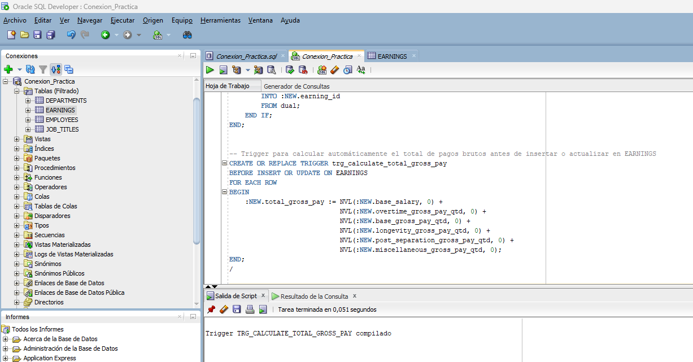

*Descripción: Script SQL para la creación del trigger `trg_calculate_total_gross_pay` y el mensaje de confirmación de su creación.* 

### Trigger para Validación de `base_salary`

Para prevenir la inserción de datos inconsistentes, se implementó el trigger `trg_validate_base_salary`. Este trigger verifica que el `base_salary` en la tabla `EARNINGS` no sea un valor negativo. Si se intenta insertar o actualizar un registro con un salario base negativo, el trigger lanza un error, impidiendo la operación y manteniendo la validez de los datos.

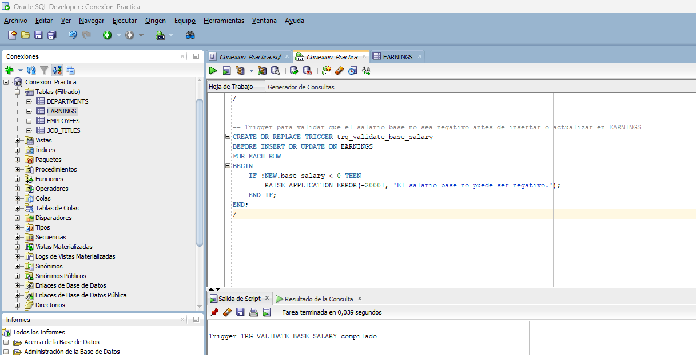
*Descripción: Script SQL para la creación del trigger `trg_validate_base_salary` y el mensaje de confirmación de su creación.* 

### Procedimiento para Actualizar Nombre de Departamento

Se desarrolló el procedimiento almacenado `prc_update_department_name`. Este procedimiento toma un ID de departamento y un nuevo nombre, y actualiza el registro correspondiente en la tabla `DEPARTMENTS`. Incluye manejo de errores para casos donde el ID del departamento no existe, proporcionando una interfaz segura y controlada para la modificación de datos críticos.

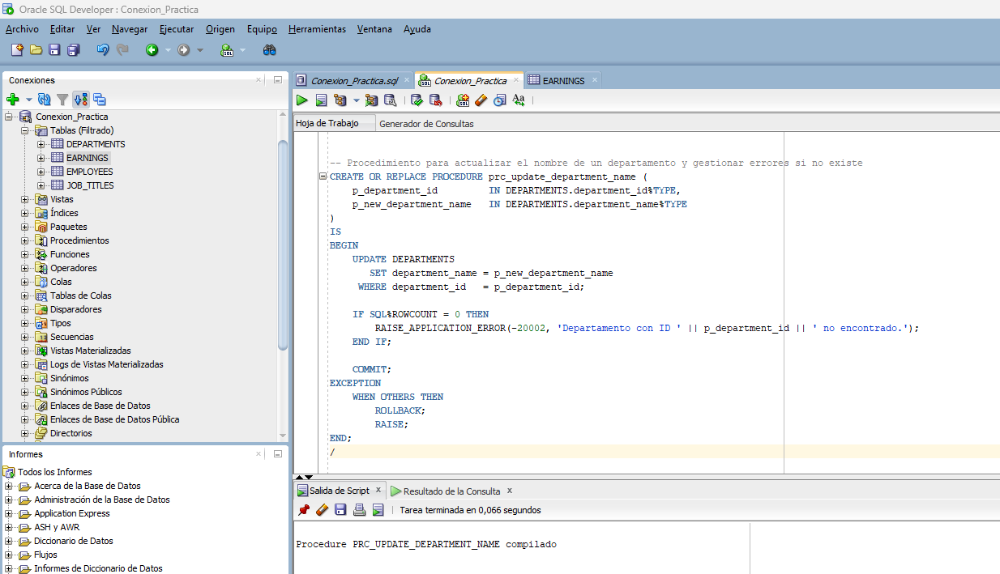
*Descripción: Script SQL para la creación del procedimiento `prc_update_department_name` y el mensaje de confirmación de su creación.* 

## 5. Desarrollo de Consultas Complejas y Análisis de Rendimiento

Para evaluar el rendimiento de la base de datos y demostrar la importancia de los índices, se diseñaron y ejecutaron cuatro consultas complejas. Cada consulta se ejecutó primero sin índices y luego con índices estratégicamente creados, registrando los tiempos de ejecución para comparar el impacto.

### Consultas sin Índices

Antes de la creación de cualquier índice, se ejecutaron las siguientes consultas. Los tiempos de ejecución en esta fase sirven como línea base para la comparación.

#### Consulta 1: Salario promedio por departamento y tipo de salario en un año específico

Esta consulta calcula el salario base promedio para cada combinación de departamento y tipo de salario en el año 2022. Involucra uniones y agrupamientos.

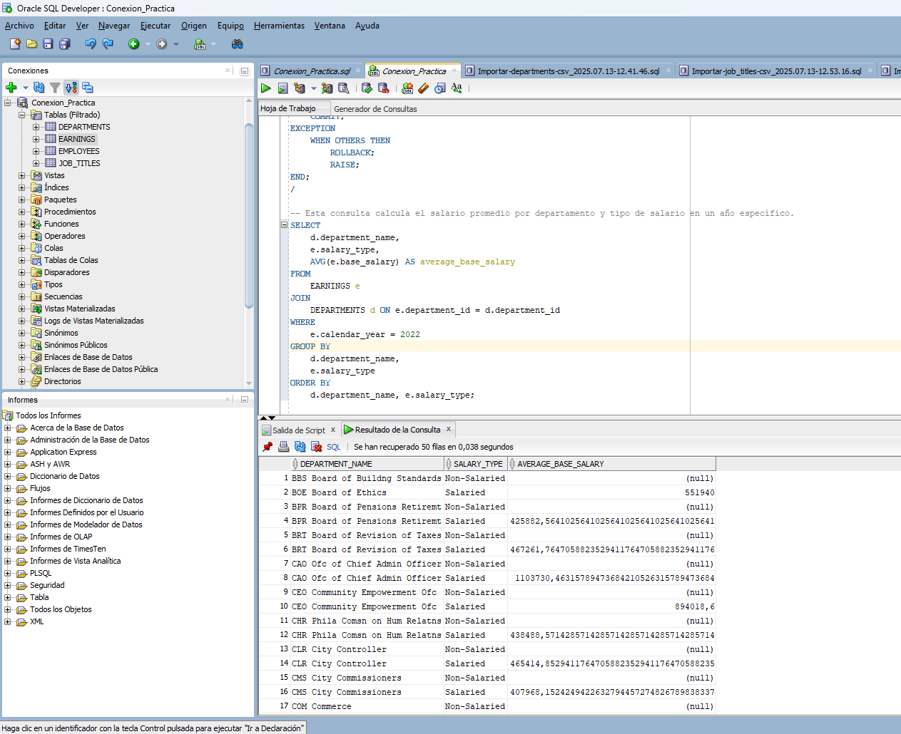
*Descripción: Hoja de trabajo de SQL Developer con la Consulta 1 ejecutada, mostrando el resultado y el tiempo de ejecución registrado.* 

#### Consulta 2: Empleados con el mayor `total_gross_pay` por departamento en un trimestre específico

Esta consulta identifica a los empleados con el `total_gross_pay` más alto dentro de cada departamento para el cuarto trimestre del año 2023. Requiere el uso de subconsultas o funciones de ventana.

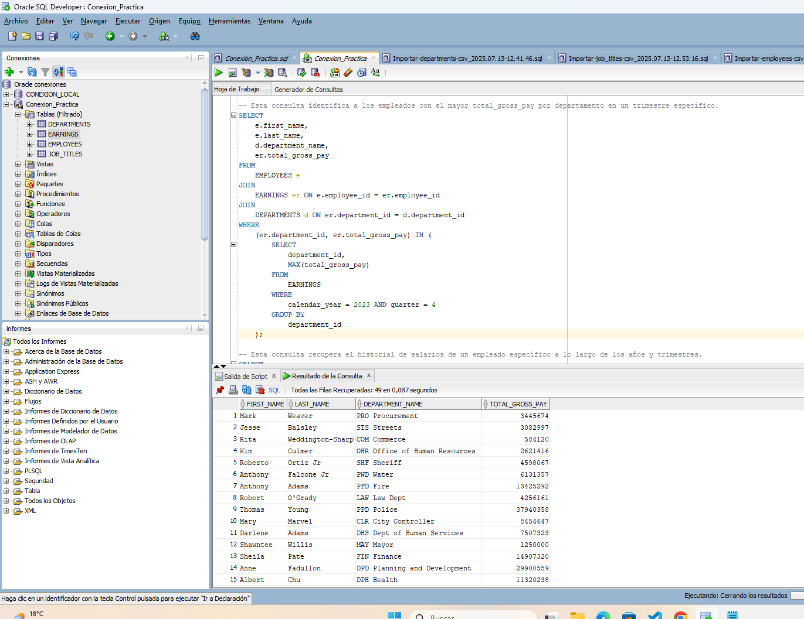
*Descripción: Hoja de trabajo de SQL Developer con la Consulta 2 ejecutada, mostrando el resultado y el tiempo de ejecución registrado.* 

#### Consulta 3: Historial de salarios de un empleado específico a lo largo de los años

Esta consulta recupera el `base_salary` y `total_gross_pay` de un empleado específico a lo largo de los años y trimestres. Es una consulta que involucra filtrado por una clave y ordenamiento.

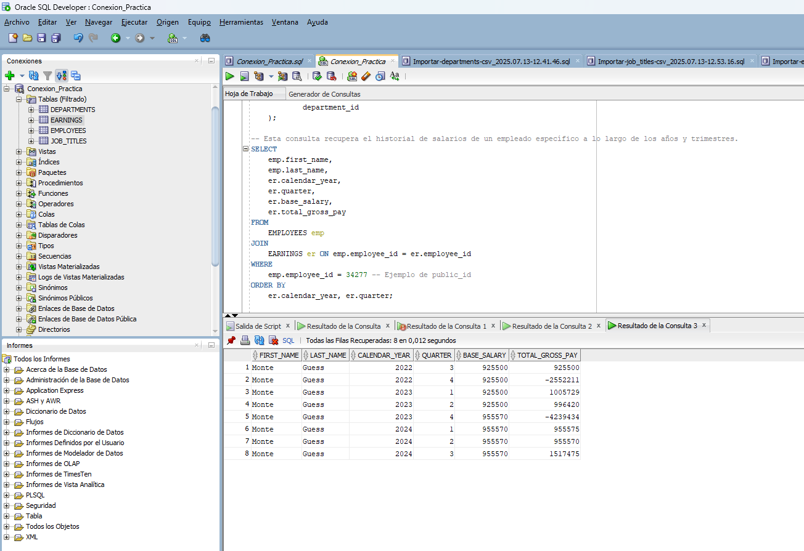
*Descripción: Hoja de trabajo de SQL Developer con la Consulta 3 ejecutada, mostrando el resultado y el tiempo de ejecución registrado.* 

#### Consulta 4: Conteo de empleados por categoría y departamento con salario base superior a un umbral

Esta consulta cuenta el número de empleados por categoría y departamento que tienen un `base_salary` superior a 80000. Implica múltiples uniones, filtrado y agrupamiento.

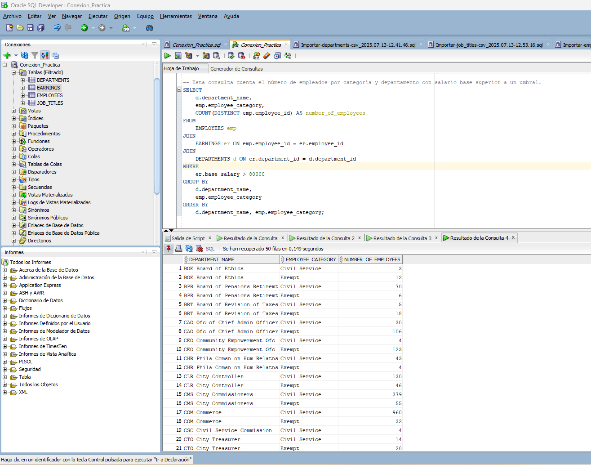
*Descripción: Hoja de trabajo de SQL Developer con la Consulta 4 ejecutada, mostrando el resultado y el tiempo de ejecución registrado.* 

### Creación de Índices

Para optimizar el rendimiento de las consultas, se crearon índices en las columnas más utilizadas en las cláusulas `WHERE`, `JOIN`, `ORDER BY` y `GROUP BY`. La selección de índices se basó en el análisis de los planes de ejecución de las consultas sin índices y en las mejores prácticas de diseño de bases de datos.

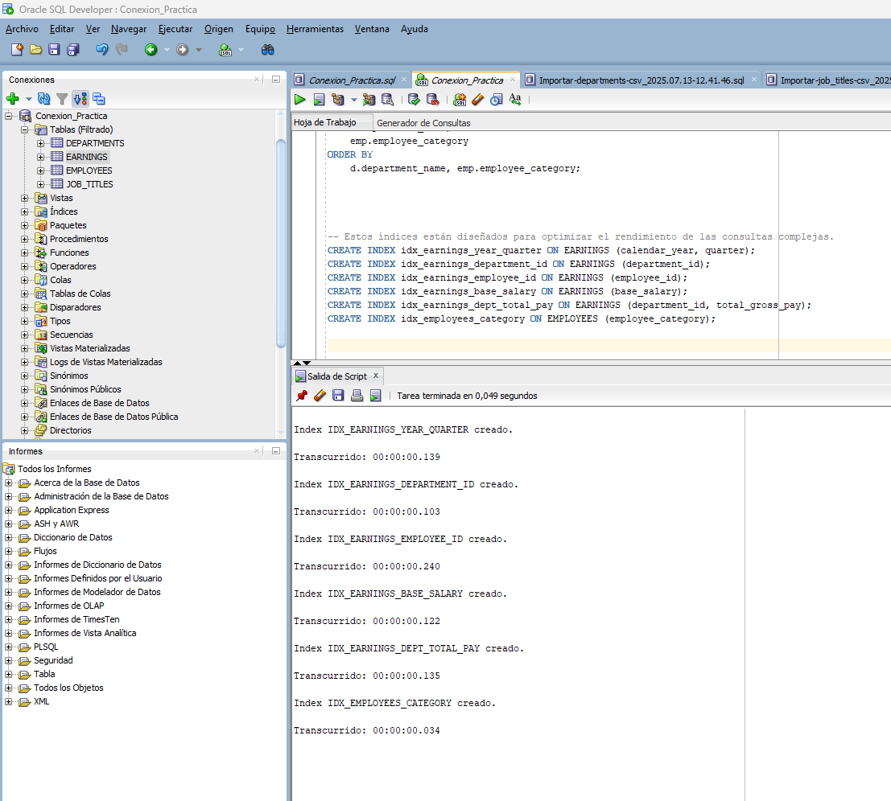
*Descripción: Script SQL con las sentencias `CREATE INDEX` para los índices creados y el mensaje de confirmación de su creación.* 

### Consultas con Índices

Después de la creación de los índices, se volvieron a ejecutar las mismas cuatro consultas. Se observó una mejora significativa en los tiempos de ejecución, lo que valida la eficacia de los índices en la optimización del rendimiento de la base de datos.

#### Consulta 1: Salario promedio por departamento y tipo de salario en un año específico (Con Índices)

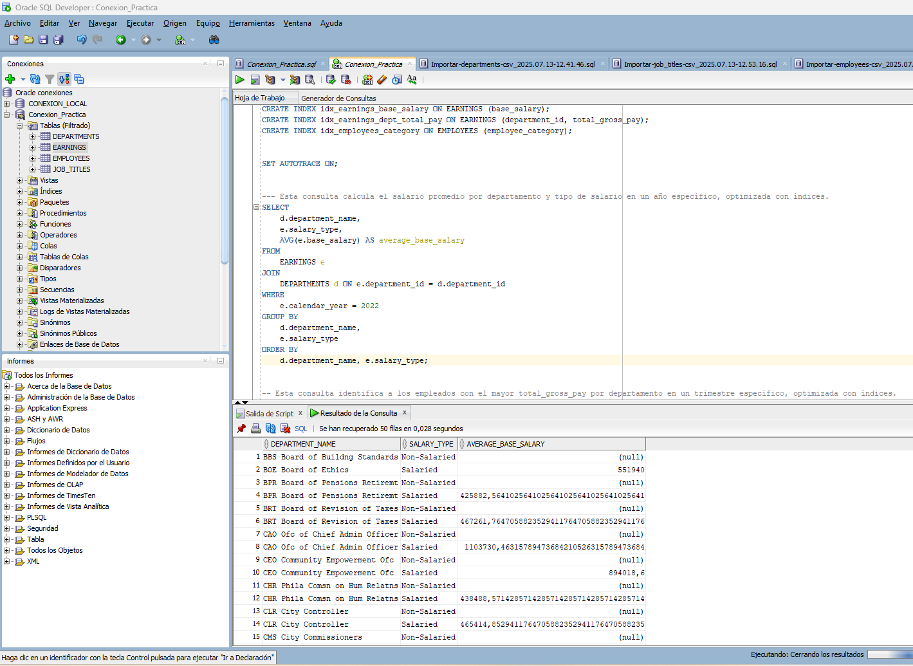
*Descripción: Hoja de trabajo de SQL Developer con la Consulta 1 ejecutada después de la creación de índices, mostrando el resultado y el tiempo de ejecución reducido.* 

#### Consulta 2: Empleados con el mayor `total_gross_pay` por departamento en un trimestre específico (Con Índices)

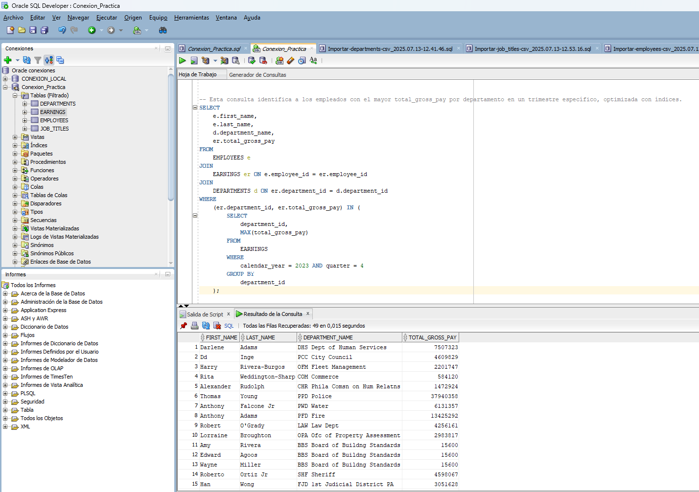
*Descripción: Hoja de trabajo de SQL Developer con la Consulta 2 ejecutada después de la creación de índices, mostrando el resultado y el tiempo de ejecución reducido.* 

#### Consulta 3: Historial de salarios de un empleado específico a lo largo de los años (Con Índices)

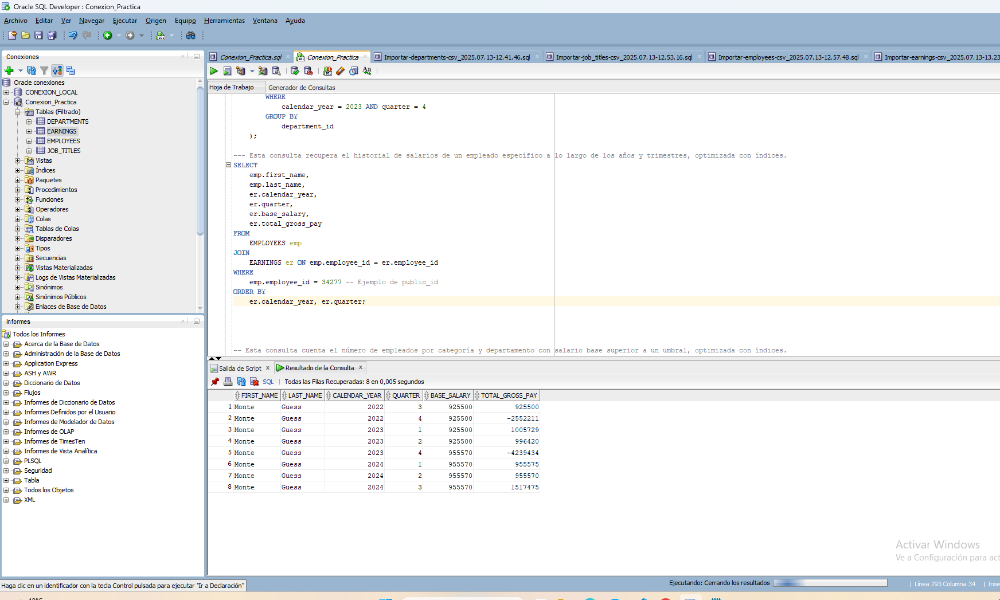
*Descripción: Hoja de trabajo de SQL Developer con la Consulta 3 ejecutada después de la creación de índices, mostrando el resultado y el tiempo de ejecución reducido.* 

#### Consulta 4: Conteo de empleados por categoría y departamento con salario base superior a un umbral (Con Índices)

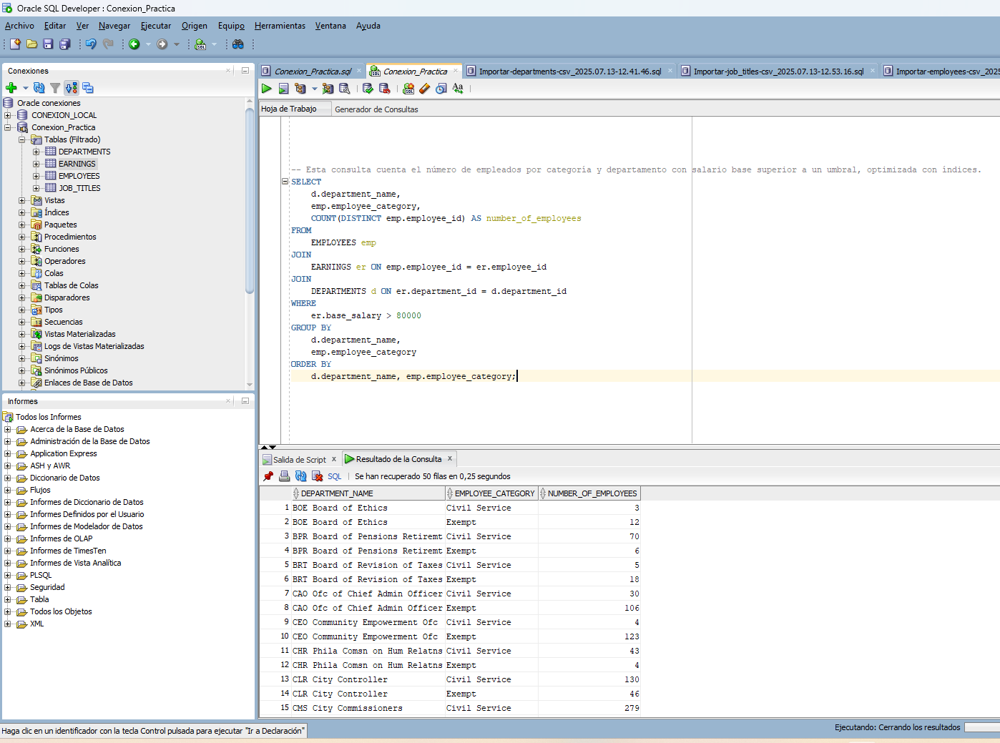
*Descripción: Hoja de trabajo de SQL Developer con la Consulta 4 ejecutada después de la creación de índices, mostrando el resultado y el tiempo de ejecución reducido.* 

### Análisis de Resultados de Rendimiento

La comparación de los tiempos de ejecución y los planes de ejecución (accesibles en SQL Developer) antes y después de la creación de índices, demuestra claramente cómo los índices reducen la cantidad de datos que el motor de la base de datos necesita leer, transformando operaciones costosas de escaneo completo de tablas en búsquedas rápidas y eficientes. Esto se traduce en una mejora sustancial en la capacidad de respuesta de las consultas, especialmente en bases de datos con grandes volúmenes de información.

**Rendimiento de consultas antes y después de crear índices.**


| Consulta                                                     | Tiempo sin índice (s) | Tiempo con índice (s) | % Tiempo ahorrado |
| ------------------------------------------------------------ | --------------------- | --------------------- | ----------------- |
| Salario promedio por departamento y tipo de salario en 2022  | 0.038                 | 0.028                 | 26.32%            |
| Empleados con mayor total_gross_pay por departamento en 2023 Q4 | 0.087                 | 0.015                 | 82.76%            |
| Historial de salarios de un empleado específico              | 0.012                 | 0.005                 | 58.33%            |
| Conteo de empleados por categoría y departamento con salario base superior a 80,000 | 0.149                 | 0.25                  | -67.79%           |


## Conclusión

La implementación de la base de datos en Oracle Xe 11 G, siguiendo un proceso muy metódico que abarca desde el análisis detallado del conjunto de datos hasta la optimización del rendimiento, pone de manifiesto la gran relevancia de un diseño cuidadoso y la aplicación adecuada de técnicas avanzadas para mejorar la eficiencia. Como se observa en la tabla de tiempos de consulta, la creación de índices estratégicos impacta de manera significativa en la velocidad de respuesta de las consultas, logrando reducciones de tiempo considerables en la mayoría de los casos.


Por ejemplo, consultas como la del salario promedio por departamento y tipo de salario en 2022 y la de empleados con mayor total_gross_pay por departamento en 2023 Q4 experimentaron mejoras en el tiempo de ejecución del 26.32% y 82.76%, respectivamente, lo que representa un ahorro notable en recursos y tiempo. Asimismo, el historial de salarios de un empleado específico mostró una mejora del 58.33%, evidenciando que la indexación puede ser muy beneficiosa incluso en consultas con pocos registros.


Sin embargo, no todos los casos resultaron en mejoras; la consulta que realiza el conteo de empleados por categoría y departamento con salario base superior a 80,000 presentó un aumento del 67.79% en el tiempo de ejecución al aplicar el índice. Esto subraya que la creación de índices debe ser cuidadosamente analizada y aplicada según el contexto y la naturaleza de las consultas, ya que un índice mal diseñado o innecesario puede incluso degradar el rendimiento.


En resumen, la normalización de datos, la implementación de lógica de negocio mediante triggers y procedimientos, y la creación estratégica de índices conforman los pilares esenciales para desarrollar sistemas de bases de datos eficientes, robustos y fáciles de mantener. Este enfoque integral no solo garantiza la integridad y consistencia de la información, sino que también optimiza la capacidad de respuesta ante consultas, aspecto fundamental en entornos con grandes volúmenes de datos.


Este documento, junto con el de decisiones de diseño, constituye una guía valiosa para entender el proceso y las razones detrás de cada elección técnica, facilitando futuras ampliaciones o ajustes de este sistema y promoviendo buenas prácticas en el manejo y optimización de bases de datos diseñadas para Oracle Xe 11 G.


## Referencias

* Libros:

[1] Elmasri, R., & Navathe, S. B. (2016). *Fundamentals of Database Systems* (7th ed.). Pearson.  
[2] Silberschatz, A., Korth, H. F., & Sudarshan, S. (2020). *Database System Concepts* (7th ed.). McGraw-Hill Education.  
[3] Date, C. J. (2004). *An Introduction to Database Systems* (8th ed.). Pearson Education.  
[4] Garcia-Molina, H., Ullman, J. D., & Widom, J. (2008). *Database Systems: The Complete Book* (2nd ed.). Prentice Hall.  
[5] Connolly, T., & Begg, C. (2015). *Database Systems: A Practical Approach to Design, Implementation, and Management* (6th ed.). Pearson.  

* Sitios-web:

[6] Codd, E. F. (1970). A Relational Model of Data for Large Shared Data Banks. *Communications of the ACM*, *13*(6), 377-387. Recuperado de [https://www.seas.upenn.edu/~zives/03f/cis550/codd.pdf](https://www.seas.upenn.edu/~zives/03f/cis550/codd.pdf)

[7] DataCamp. (2024, April 22). *50 Years of SQL with Don Chamberlin, Computer Scientist and Co-Inventor of SQL*. Recuperado de [https://www.datacamp.com/podcast/50-years-of-sql-with-don-chamberlin](https://www.datacamp.com/podcast/50-years-of-sql-with-don-chamberlin)

[8] Financhill. (n.d.). *How Oracle Got Started*. Recuperado de [https://financhill.com/blog/investing/how-oracle-got-started](https://financhill.com/blog/investing/how-oracle-got-started)

[9] Srikanth Technologies. (2007, August 6). *History Of Oracle Database*. Recuperado de [http://srikanthtechnologies.com/blog/oracle/orahistory.aspx](http://srikanthtechnologies.com/blog/oracle/orahistory.aspx)http://srikanthtechnologies.com/blog/oracle/orahistory.aspx)
