# Documentación del Procedimiento: Implementación de Base de Datos Oracle XE 11g con SQL Developer

## Integrantes

* Marco Abarca R.
* Alex Jadan
* Luis Sarango


## Índice

- [Introducción](#introducción)
- [1. Análisis del Dataset y Diseño del Modelo Relacional](#1-análisis-del-dataset-y-diseño-del-modelo-relacional)
- [2. Creación de Modelos y Scripts SQL](#2-creación-de-modelos-y-scripts-sql)
  - [Modelo Conceptual](#modelo-conceptual)
  - [Modelo Lógico](#modelo-lógico)
  - [Modelo Físico](#modelo-físico)
- [3. Importación de Datos CSV](#3-importación-de-datos-csv)
- [4. Implementación de Triggers, Procedimientos y Funciones](#4-implementación-de-triggers-procedimientos-y-funciones)
  - [Trigger para Cálculo de `total_gross_pay`](#trigger-para-cálculo-de-total_gross_pay)
  - [Trigger para Validación de `base_salary`](#trigger-para-validación-de-base_salary)
  - [Procedimiento para Actualizar Nombre de Departamento](#procedimiento-para-actualizar-nombre-de-departamento)
- [5. Desarrollo de Consultas Complejas y Análisis de Rendimiento](#5-desarrollo-de-consultas-complejas-y-análisis-de-rendimiento)
  - [Consultas sin Índices](#consultas-sin-índices)
    - [Consulta 1: Salario promedio por departamento y tipo de salario en un año específico](#consulta-1-salario-promedio-por-departamento-y-tipo-de-salario-en-un-año-específico)
    - [Consulta 2: Empleados con el mayor `total_gross_pay` por departamento en un trimestre específico](#consulta-2-empleados-con-el-mayor-total_gross_pay-por-departamento-en-un-trimestre-específico)
    - [Consulta 3: Historial de salarios de un empleado específico a lo largo de los años](#consulta-3-historial-de-salarios-de-un-empleado-específico-a-lo-largo-de-los-años)
    - [Consulta 4: Conteo de empleados por categoría y departamento con salario base superior a un umbral](#consulta-4-conteo-de-empleados-por-categoría-y-departamento-con-salario-base-superior-a-un-umbral)
  - [Creación de Índices](#creación-de-índices)
  - [Consultas con Índices](#consultas-con-índices)
    - [Consulta 1: Salario promedio por departamento y tipo de salario en un año específico (Con Índices)](#consulta-1-salario-promedio-por-departamento-y-tipo-de-salario-en-un-año-específico-con-índices)
    - [Consulta 2: Empleados con el mayor `total_gross_pay` por departamento en un trimestre específico (Con Índices)](#consulta-2-empleados-con-el-mayor-total_gross_pay-por-departamento-en-un-trimestre-específico-con-índices)
    - [Consulta 3: Historial de salarios de un empleado específico a lo largo de los años (Con Índices)](#consulta-3-historial-de-salarios-de-un-empleado-específico-a-lo-largo-de-los-años-con-índices)
    - [Consulta 4: Conteo de empleados por categoría y departamento con salario base superior a un umbral (Con Índices)](#consulta-4-conteo-de-empleados-por-categoría-y-departamento-con-salario-base-superior-a-un-umbral-con-índices)
  - [Análisis de Resultados de Rendimiento](#análisis-de-resultados-de-rendimiento)
- [Conclusión](#conclusión)
- [Referencias Biográficas ](#Referencias)
  - [Edgar F. Codd: El Padre del Modelo Relacional](#edgar-f-codd-el-padre-del-modelo-relacional)
  - [Los Creadores de SQL: Chamberlin y Boyce](#los-creadores-de-sql-chamberlin-y-boyce)
  - [Los Fundadores de Oracle: Ellison, Miner y Oates](#los-fundadores-de-oracle-ellison-miner-y-oates)
  - [Referencias](#referencias)

## Introducción

Este documento detalla el proceso de diseño, implementación y optimización de una base de datos en Oracle XE 11g utilizando SQL Developer, a partir de un conjunto de datos proporcionado en formato CSV. El objetivo es construir un modelo de datos relacional robusto, importar eficientemente los datos, e incorporar lógica de negocio mediante triggers y procedimientos almacenados. Además, se analizará el rendimiento de consultas complejas, con y sin la aplicación de índices, para demostrar su impacto en la eficiencia de la base de datos.

La información aquí presentada busca ser una guía clara y concisa, permitiendo una comprensión rápida de los pasos clave y las decisiones tomadas durante el desarrollo. Se incluyen marcadores para capturas de pantalla que complementarán visualmente cada etapa del proceso.

## 1. Análisis del Dataset y Diseño del Modelo Relacional

El primer paso crucial fue comprender la estructura del archivo  que escojimos: `employee_earnings_300000.csv`. Este dataset contiene una gran cantidad de registros relacionados con las ganancias de empleados, incluyendo información sobre su identidad, departamento, puesto de trabajo y diversos componentes salariales. La inspección inicial reveló la necesidad de normalizar los datos para evitar redundancias y asegurar la integridad referencial.

Se identificaron las siguientes entidades principales:

*   **EMPLOYEES**: Para almacenar la información básica de cada empleado.
*   **DEPARTMENTS**: Para los nombres y números de los departamentos.
*   **JOB_TITLES**: Para los códigos y títulos de los puestos de trabajo.
*   **EARNINGS**: Para los registros de ganancias de los empleados, que incluyen detalles salariales por año y trimestre.

La relación entre estas entidades es fundamental. Un empleado pertenece a un departamento y ocupa un puesto de trabajo. Los registros de ganancias están directamente asociados a un empleado, y a su vez, a un departamento y un puesto de trabajo, lo que permite un análisis detallado de las remuneraciones.

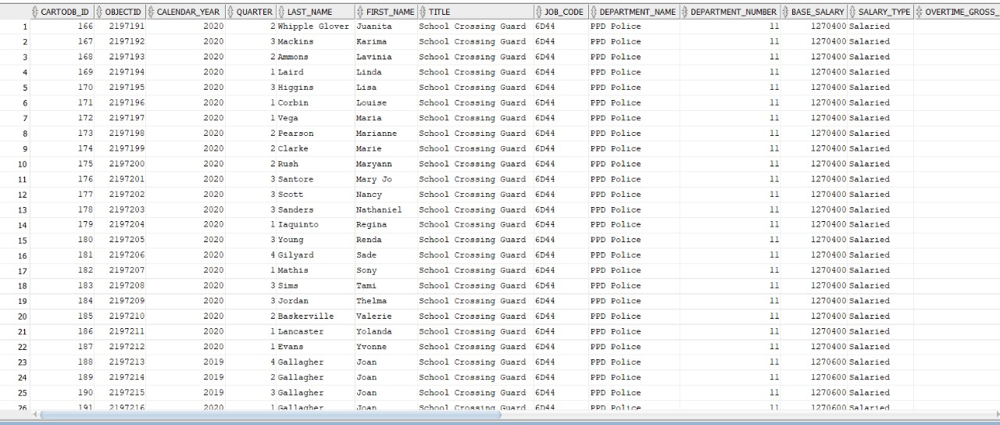
*Descripción: Vista de las primeras filas del archivo CSV, mostrando las columnas y el formato de los datos.* 

## 2. Creación de Modelos y Scripts SQL

El diseño de la base de datos se articuló a través de modelos conceptual, lógico y físico. Estos modelos sirvieron como planos para la construcción de la base de datos, asegurando una estructura coherente y optimizada.

### Modelo Conceptual

Representa las entidades y sus relaciones a un alto nivel, enfocándose en el 'qué' del negocio. Aquí se definieron las entidades `EMPLOYEE`, `DEPARTMENT`, `JOB_TITLE` y `EARNINGS` y sus interconexiones básicas.


*Descripción: Diagrama que ilustra las entidades principales y sus relaciones generales.* 

### Modelo Lógico

Este modelo refina el conceptual, añadiendo atributos específicos a cada entidad y detallando las relaciones, pero aún de forma independiente de la tecnología de base de datos. Se definieron las claves primarias y foráneas lógicas.

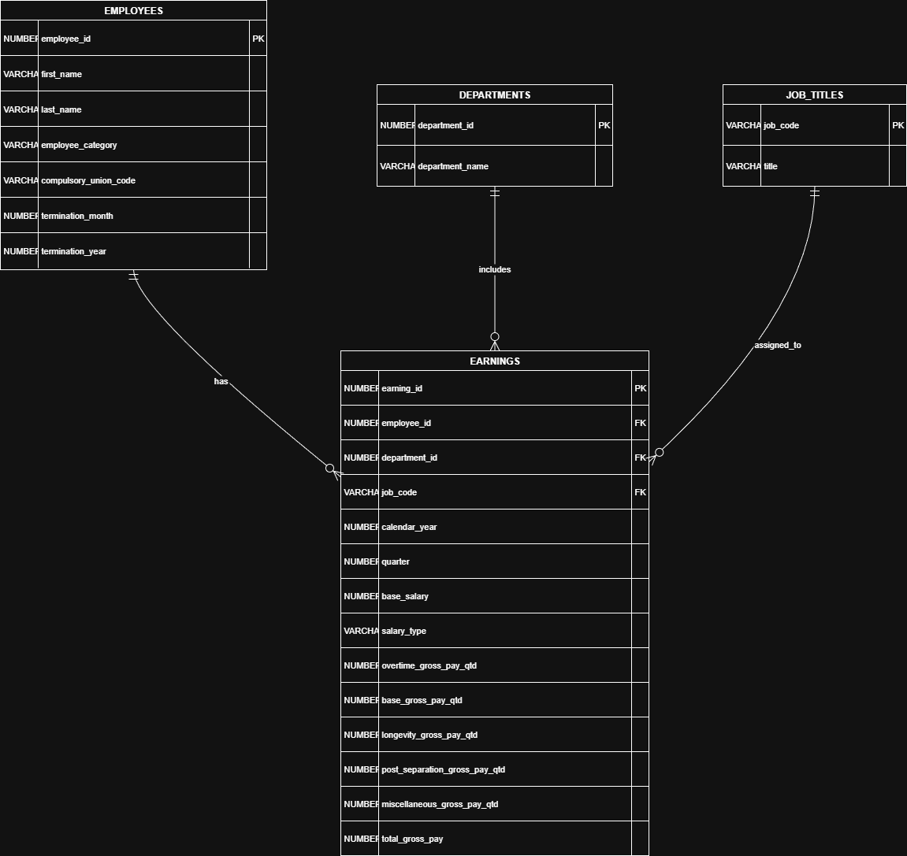
*Descripción: Diagrama que muestra las entidades con sus atributos y las relaciones detalladas.* 

### Modelo Físico

El modelo físico es la implementación concreta para Oracle XE 11g. Se tradujeron las entidades y atributos a tablas y columnas SQL, especificando tipos de datos, restricciones de integridad (claves primarias, foráneas, `NOT NULL`) y la definición de secuencias para IDs autoincrementales. Los scripts SQL para la creación de estas tablas se generaron cuidadosamente para asegurar la compatibilidad y eficiencia con Oracle.

```sql
CREATE TABLE EMPLOYEES (
    employee_id NUMBER ,
    first_name VARCHAR2(100),
    last_name VARCHAR2(100),
    employee_category VARCHAR2(50),
    compulsory_union_code VARCHAR2(10),
    termination_month NUMBER(2),
    termination_year NUMBER(4)
);

CREATE TABLE DEPARTMENTS (
    department_id NUMBER ,
    department_name VARCHAR2(200)
);

CREATE TABLE JOB_TITLES (
    job_code VARCHAR2(20) ,
    title VARCHAR2(200)
);

CREATE TABLE EARNINGS (
    earning_id NUMBER,
    employee_id NUMBER NOT NULL,
    department_id NUMBER NOT NULL,
    job_code VARCHAR2(20) NOT NULL,
    calendar_year NUMBER(4) NOT NULL,
    quarter NUMBER(1) NOT NULL,
    base_salary NUMBER(10, 2),
    salary_type VARCHAR2(50),
    overtime_gross_pay_qtd NUMBER(10, 2),
    base_gross_pay_qtd NUMBER(10, 2),
    longevity_gross_pay_qtd NUMBER(10, 2),
    post_separation_gross_pay_qtd NUMBER(10, 2),
    miscellaneous_gross_pay_qtd NUMBER(10, 2),
    total_gross_pay NUMBER(10, 2)
);

CREATE SEQUENCE earnings_seq
START WITH 1
INCREMENT BY 1
NOCACHE
NOCYCLE;

CREATE OR REPLACE TRIGGER earnings_before_insert -- trigger de control
BEFORE INSERT ON EARNINGS
FOR EACH ROW
BEGIN
    IF :NEW.earning_id IS NULL THEN
        SELECT earnings_seq.NEXTVAL
        INTO :NEW.earning_id
        FROM dual;
    END IF;
END;


```


*Descripción: Creación de la Tabla `DEPARTMENTS`*

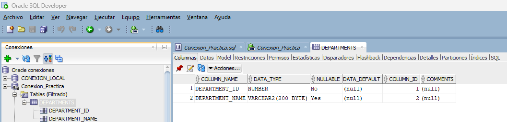

*Descripción: Propiedades de la Tabla `DEPARTMENTS`*


*Descripción: Creación de la Tabla `JOB_TITLES`*

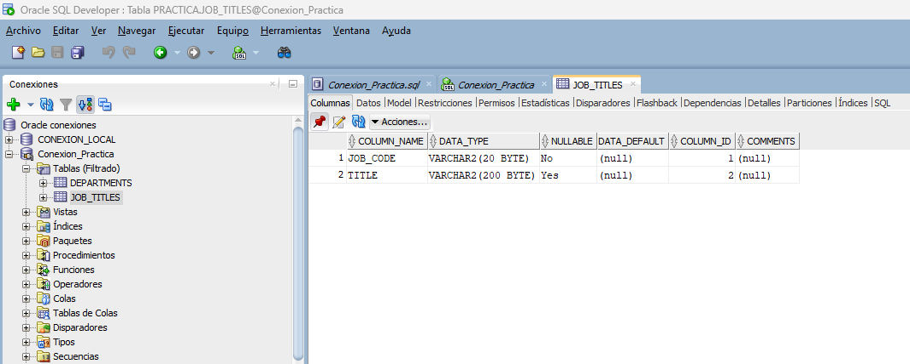

*Descripción: Propiedades de la Tabla `JOB_TITLES`*

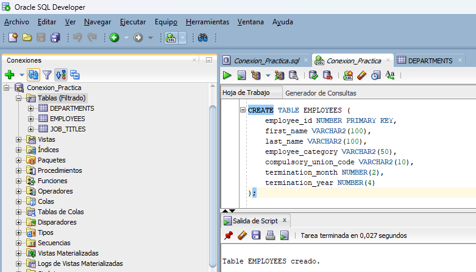

*Descripción: Creacion de la Tabla `EMPLEADOS`*


*Descripción: Propiedades de la Tabla `EARNINGS`*

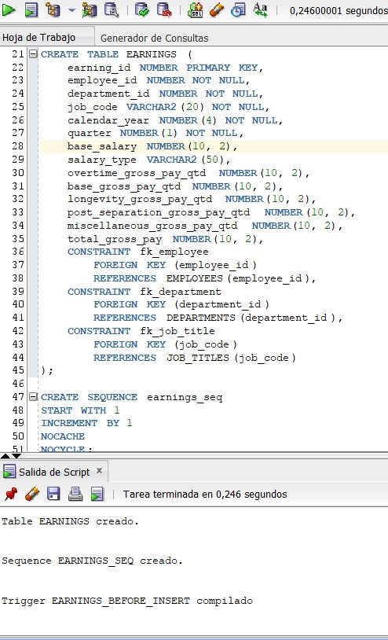


*Descripción: Creacion de la Tabla `EARNINGS`*

***Descripción General: Fragmento del script SQL con las sentencias `CREATE TABLE` para las tablas `EMPLOYEES`, `DEPARTMENTS`, `JOB_TITLES` y `EARNINGS`.*** 

## 3. Importación de Datos CSV

La importación de 300,000 registros desde el CSV a la estructura relacional diseñada fue un paso crítico. Se optó por un enfoque en dos fases para manejar las dependencias de claves foráneas y asegurar la correcta normalización de los datos:

1.  **Carga a una Tabla Temporal de Respaldo (Como metodo de fallback):** Primero, el CSV completo se importó a una tabla temporal (`TEMP_EMPLOYEE_EARNINGS`) con todas las columnas definidas como `VARCHAR2`. Esto minimizó los problemas de tipo de datos durante la carga inicial.

​	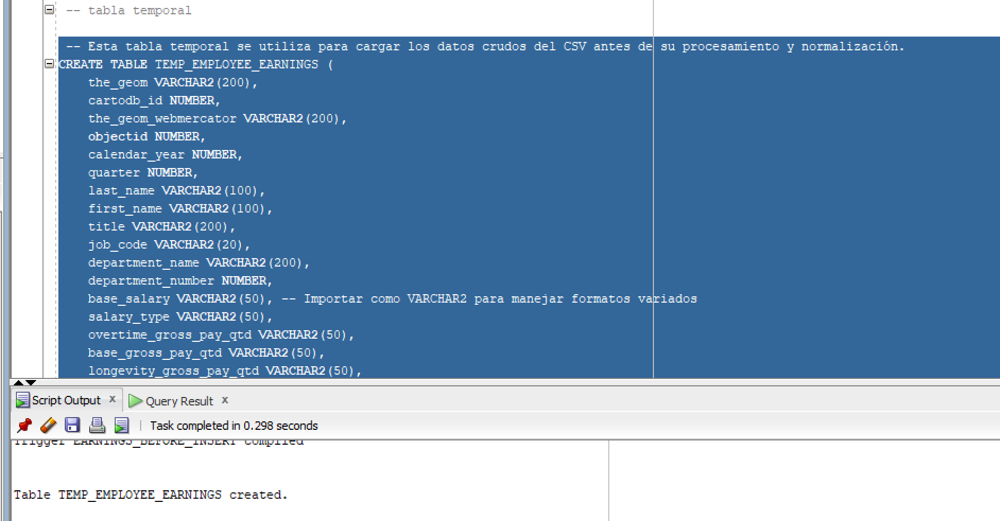	

*Descripción: Script SQL para la creación de la tabla `TEMP_EMPLOYEE_EARNINGS`.* 

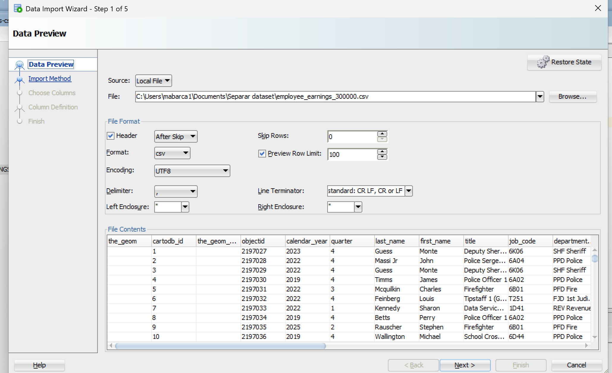

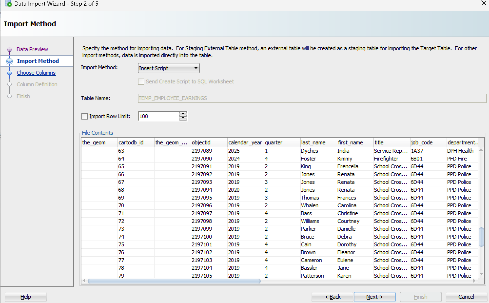

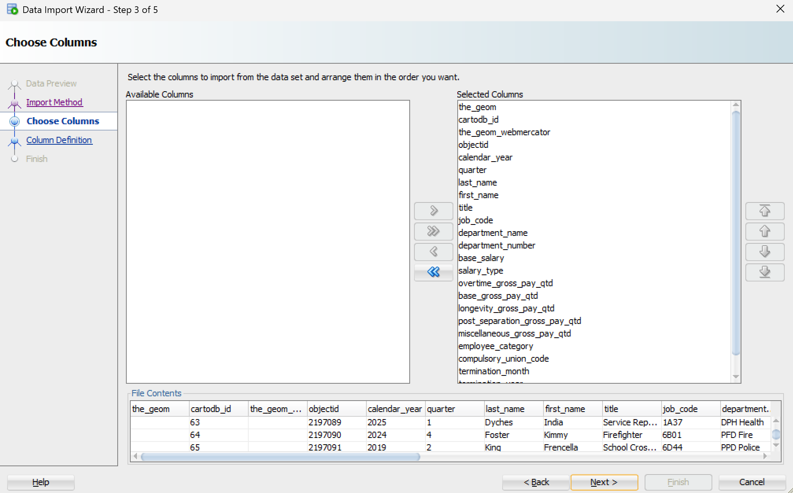

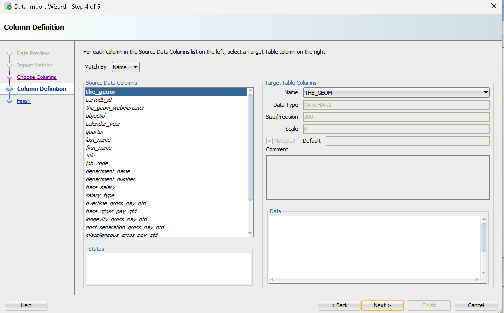

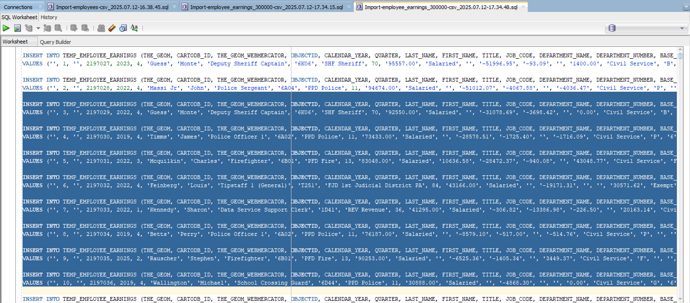

*Descripción: Proceso de importación del CSV a `TEMP_EMPLOYEE_EARNINGS` usando el asistente de SQL Developer.* 

2. **Limpiar el Dataset Completo:**

   * Usamos pandas, una libreria rica en el manejo de datos en python para limpiar el csv y enlistarlo para ser importado hacia nuestra base de datos :

   ```python
   import pandas as pd
   
   # 1️⃣ Cargar el CSV original
   df = pd.read_csv('employee_earnings_300000.csv')
   
   # 2️⃣ Calcular 'total_gross_pay' como columna derivada para earnings
   df['total_gross_pay'] = (
       df['base_salary'].fillna(0) +
       df['overtime_gross_pay_qtd'].fillna(0) +
       df['base_gross_pay_qtd'].fillna(0) +
       df['longevity_gross_pay_qtd'].fillna(0) +
       df['post_separation_gross_pay_qtd'].fillna(0) +
       df['miscellaneous_gross_pay_qtd'].fillna(0)
   )
   
   # --------------- DEPARTMENTS ---------------
   cols_departments = ['department_number', 'department_name']
   df_departments = df[cols_departments].drop_duplicates(subset=['department_number'])
   df_departments = df_departments.rename(columns={'department_number': 'department_id'})
   df_departments.to_csv('departments.csv', index=False)
   
   # --------------- JOB_TITLES ---------------
   cols_job_titles = ['job_code', 'title']
   df_job_titles = df[cols_job_titles].drop_duplicates(subset=['job_code'])
   df_job_titles.to_csv('job_titles.csv', index=False)
   
   # --------------- EMPLOYEES ---------------
   cols_employees = ['public_id', 'first_name', 'last_name', 'employee_category',
                     'compulsory_union_code', 'termination_month', 'termination_year']
   df_employees = df[cols_employees].drop_duplicates(subset=['public_id'])
   df_employees = df_employees.rename(columns={'public_id': 'employee_id'})
   df_employees.to_csv('employees.csv', index=False)
   
   # --------------- EARNINGS ---------------
   cols_earnings = ['public_id', 'department_number', 'job_code', 'calendar_year', 'quarter',
                    'base_salary', 'salary_type', 'overtime_gross_pay_qtd',
                    'base_gross_pay_qtd', 'longevity_gross_pay_qtd',
                    'post_separation_gross_pay_qtd', 'miscellaneous_gross_pay_qtd',
                    'total_gross_pay']
   
   df_earnings = df[cols_earnings].copy()
   df_earnings = df_earnings.rename(columns={
       'public_id': 'employee_id',
       'department_number': 'department_id'
   })
   # Aquí, si deseas eliminar duplicados exactos en earnings (opcional):
   # df_earnings = df_earnings.drop_duplicates()
   
   df_earnings.to_csv('earnings.csv', index=False)
   
   # Mensajes de confirmación
   print("✅ Archivos limpios y separados generados exitosamente:")
   print("- departments.csv")
   print("- job_titles.csv")
   print("- employees.csv")
   print("- earnings.csv")
   
   
   ```


*Descripción: Proceso de limpieza del CSV inicial a  4 archivos resultantes: `departments.csv`, `job_titles.csv`, `employees.csv` y `earnings.csv` usando la libreria pandas de Python.* 


3. **Transformación y Carga a Tablas Finales:** Como metodo de fallback importariamos los datos desde la tabla temporal, utilizando sentencias `INSERT INTO ... SELECT FROM` para poblar las tablas `DEPARTMENTS`, `JOB_TITLES`, `EMPLOYEES` y `EARNINGS`. Sin embargo, importamos los archivos `csv` limpios con nuestro script de `python` como metodo principal. Este método permitió extraer los valores únicos para `DEPARTMENTS` y `JOB_TITLES`, y resolver las claves foráneas sin mayor dificultad. Además, se realizaron conversiones de tipo de datos y cálculos de atributos derivados (como `total_gross_pay`) durante este proceso.


*Descripción: Visualizacion de un trigger de control para la tabla `EARNINGS` antes de la importación, mostrando la omision de valores nulos antes de la importacion. Evitando asi futuros conflictos* 


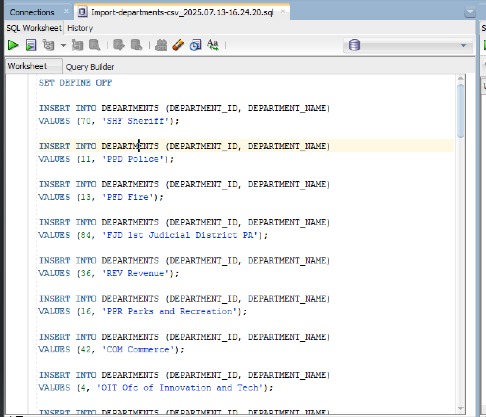


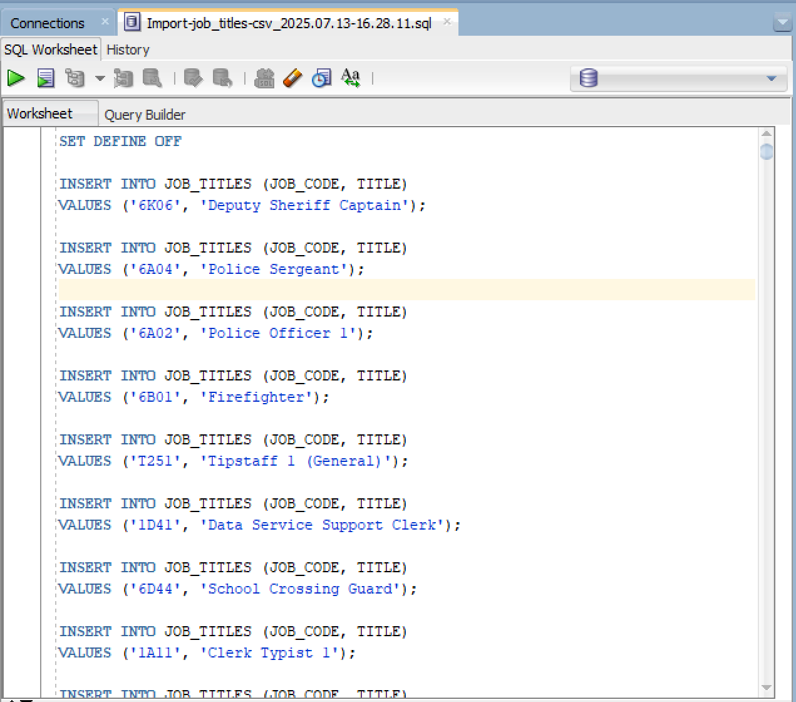


*Descripción: Sentencias `INSERT INTO ... SELECT DISTINCT` para poblar las tablas `DEPARTMENTS` y `JOB_TITLES`.* 


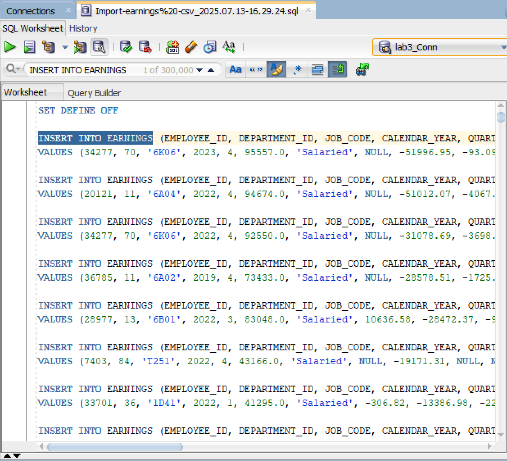


*Descripción: Sentencias `INSERT INTO ... SELECT` para poblar las tablas `EMPLOYEES` y `EARNINGS`, incluyendo el paso a la prueba lógica para `total_gross_pay` (un atributo derivado, que se calculo transparentemente, gracias a nuestro trigger definido en la subsecuente seccion .* 


## 4. Implementación de Triggers, Procedimientos y Funciones

Para asegurar la integridad de los datos y automatizar ciertas tareas, se implementaron triggers y procedimientos almacenados. Estas piezas de lógica de base de datos son esenciales para mantener la consistencia y aplicar reglas de negocio directamente en el motor de la base de datos.

### Trigger para Cálculo de `total_gross_pay`

Se creó un trigger `trg_calculate_total_gross_pay` que se activa antes de cada inserción o actualización en la tabla `EARNINGS`. Su función es calcular automáticamente el `total_gross_pay` sumando los diversos componentes de pago (`base_salary`, `overtime_gross_pay_qtd`, etc.). Esto garantiza que este campo derivado siempre refleje la suma correcta de los ingresos, sin necesidad de que la aplicación cliente lo calcule.


*Descripción: Script SQL para la creación del trigger `trg_calculate_total_gross_pay` y el mensaje de confirmación de su creación.* 

### Trigger para Validación de `base_salary`

Para prevenir la inserción de datos inconsistentes, se implementó el trigger `trg_validate_base_salary`. Este trigger verifica que el `base_salary` en la tabla `EARNINGS` no sea un valor negativo. Si se intenta insertar o actualizar un registro con un salario base negativo, el trigger lanza un error, impidiendo la operación y manteniendo la validez de los datos.


*Descripción: Script SQL para la creación del trigger `trg_validate_base_salary` y el mensaje de confirmación de su creación.* 

### Procedimiento para Actualizar Nombre de Departamento

Se desarrolló el procedimiento almacenado `prc_update_department_name`. Este procedimiento toma un ID de departamento y un nuevo nombre, y actualiza el registro correspondiente en la tabla `DEPARTMENTS`. Incluye manejo de errores para casos donde el ID del departamento no existe, proporcionando una interfaz segura y controlada para la modificación de datos críticos.


*Descripción: Script SQL para la creación del procedimiento `prc_update_department_name` y el mensaje de confirmación de su creación.* 

## 5. Desarrollo de Consultas Complejas y Análisis de Rendimiento

Para evaluar el rendimiento de la base de datos y demostrar la importancia de los índices, se diseñaron y ejecutaron cuatro consultas complejas. Cada consulta se ejecutó primero sin índices y luego con índices estratégicamente creados, registrando los tiempos de ejecución para comparar el impacto.

### Consultas sin Índices

Antes de la creación de cualquier índice (incluyendo pero no limitado a llaves primarias y foraneas), se ejecutaron las siguientes consultas. Los tiempos de ejecución en esta fase sirven como línea base para la comparación.

#### Consulta 1: Salario promedio por departamento y tipo de salario en un año específico

Esta consulta calcula el salario base promedio para cada combinación de departamento y tipo de salario en el año 2022. Involucra uniones y agrupamientos.

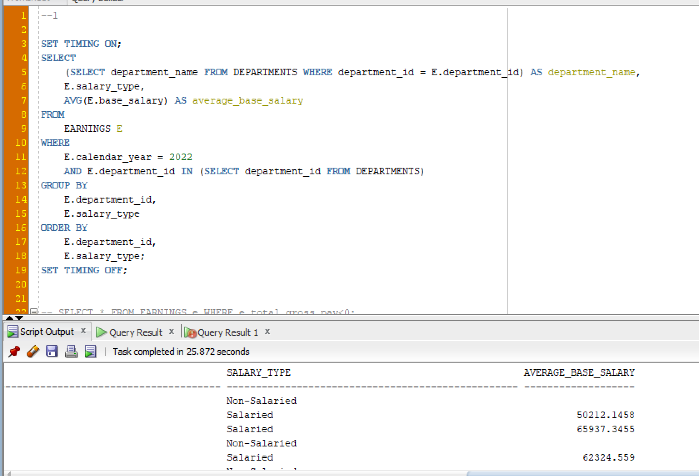

* Parte del Output (VER HOJA DE LOG en [Logs de consultas sin Indices](./output_logs/output_scripts_sinIndices.txt))

```sql
Dominique                                                                                            Smiley                                                                                               MOS Office of Sustainability                                                                                                                                                                                     94807.9
Darcel                                                                                               Laurie                                                                                               MOE Mayors Office of Education                                                                                                                                                                                  75000.06
Mona                                                                                                 Jacobs                                                                                               CEO Community Empowerment Ofc                                                                                                                                                                                  106983.53
Lori                                                                                                 Hayes                                                                                                PPR Parks and Recreation                                                                                                                                                                                       180866.49
Danielle                                                                                             Outlaw                                                                                               MDO Managing Director Office                                                                                                                                                                                   347517.98

49 rows selected. 

Elapsed: 00:00:00.354
```

*Descripción: Hoja de trabajo de SQL Developer con la Consulta 1 ejecutada, mostrando el resultado y el tiempo de ejecución registrado.* 

#### Consulta 2: Empleados con el mayor `total_gross_pay` por departamento en un trimestre específico

Esta consulta identifica a los empleados con el `total_gross_pay` más alto dentro de cada departamento para el cuarto trimestre del año 2023. Requiere el uso de subconsultas o funciones de ventana.


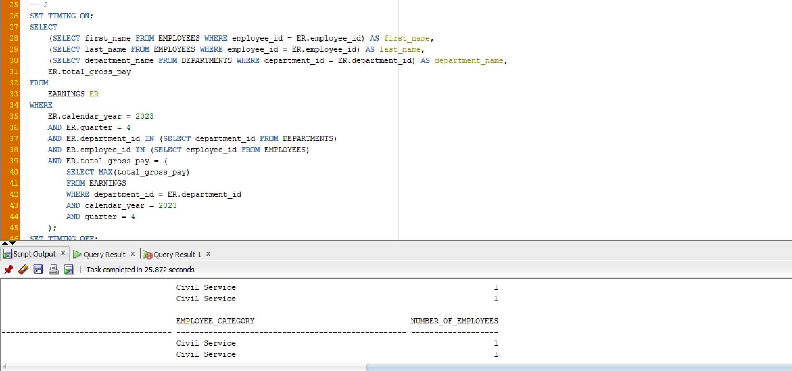*Descripción: Hoja de trabajo de SQL Developer con la Consulta 2 ejecutada, mostrando el resultado y el tiempo de ejecución registrado.* 


* Parte del Output (VER HOJA DE LOG en [Logs de consultas sin Indices](./output_logs/output_scripts_sinIndices.txt))

```sql
DEPARTMENT_NAME                                                                                                                                                                                          SALARY_TYPE                                        AVERAGE_BASE_SALARY
-------------------------------------------------------------------------------------------------------------------------------------------------------------------------------------------------------- -------------------------------------------------- -------------------
DPD Planning and Development                                                                                                                                                                             Salaried                                                    52205.5625
CMS City Commissioners                                                                                                                                                                                   Non-Salaried                                                          
CMS City Commissioners                                                                                                                                                                                   Salaried                                                    40796.8152
FJD 1st Judicial District PA                                                                                                                                                                             Non-Salaried                                                          
FJD 1st Judicial District PA                                                                                                                                                                             Salaried                                                    41969.3145

82 rows selected. 

Elapsed: 00:00:00.189

```


#### Consulta 3: Historial de salarios de un empleado específico a lo largo de los años

Esta consulta recupera el `base_salary` y `total_gross_pay` de un empleado específico a lo largo de los años y trimestres. Es una consulta que involucra filtrado por una clave y ordenamiento.


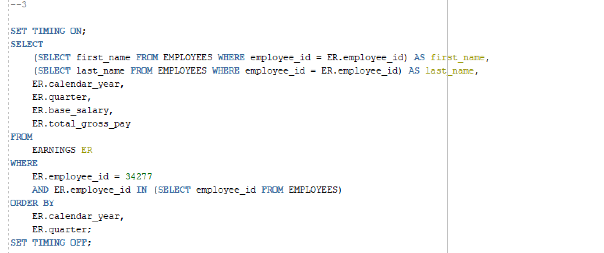*Descripción: Hoja de trabajo de SQL Developer con la Consulta 3 ejecutada, mostrando el resultado y el tiempo de ejecución registrado.* 


* Parte del Output (VER HOJA DE LOG en [Logs de consultas sin Indices](./output_logs/output_scripts_sinIndices.txt))

```sql
Adolfo                                                                                               Bosch                                                                                                CTO City Treasurer                                                                                                                                                                                              94617.44
Gerard                                                                                               Koszarek                                                                                             PPS Prisons                                                                                                                                                                                                    125896.67
Christopher                                                                                          Renfro                                                                                               STS Streets                                                                                                                                                                                                    111064.46
Nyasa                                                                                                Hendrix                                                                                              MAP Mural Arts Program                                                                                                                                                                                          59159.49
Banafsheh                                                                                            Amirzadeh                                                                                            DAO District Attorney                                                                                                                                                                                          139079.88
Ashante                                                                                              Jordan                                                                                               BPR Board of Pensions Retiremt                                                                                                                                                                                  56221.16
Christina                                                                                            Patton                                                                                               FLP Free Library of Phila                                                                                                                                                                                      126154.46
Lorraine                                                                                             Broughton                                                                                            OPA Ofc of Property Assessment                                                                                                                                                                                  97351.76
Tyesha                                                                                               Wilson                                                                                               CSC Civil Service Commission                                                                                                                                                                                    48860.96
Charnae                                                                                              Smalls                                                                                               REC Records                                                                                                                                                                                                      60648.4
Lisa                                                                                                 Bowman                                                                                               BRT Board of Revision of Taxes                                                                                                                                                                                  56043.74

FIRST_NAME                                                                                           LAST_NAME                                                                                            DEPARTMENT_NAME                                                                                                                                                                                          TOTAL_GROSS_PAY
---------------------------------------------------------------------------------------------------- ---------------------------------------------------------------------------------------------------- -------------------------------------------------------------------------------------------------------------------------------------------------------------------------------------------------------- ---------------
Dominique                                                                                            Smiley                                                                                               MOS Office of Sustainability                                                                                                                                                                                     94807.9
Darcel                                                                                               Laurie                                                                                               MOE Mayors Office of Education                                                                                                                                                                                  75000.06
Mona                                                                                                 Jacobs                                                                                               CEO Community Empowerment Ofc                                                                                                                                                                                  106983.53
Lori                                                                                                 Hayes                                                                                                PPR Parks and Recreation                                                                                                                                                                                       180866.49
Danielle                                                                                             Outlaw                                                                                               MDO Managing Director Office                                                                                                                                                                                   347517.98

49 rows selected. 

Elapsed: 00:00:00.354

```


#### Consulta 4: Conteo de empleados por categoría y departamento con salario base superior a un umbral

Esta consulta cuenta el número de empleados por categoría y departamento que tienen un `base_salary` superior a 80000. Implica múltiples uniones, filtrado y agrupamiento.


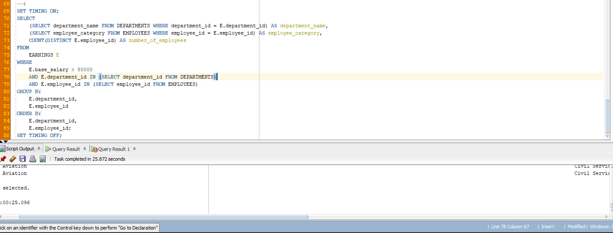

*Descripción: Hoja de trabajo de SQL Developer con la Consulta 4 ejecutada, mostrando el resultado y el tiempo de ejecución registrado.* 

* Parte del Output (VER HOJA DE LOG en [Logs de consultas sin Indices](./output_logs/output_scripts_sinIndices.txt))

```sql
EMPLOYEE_CATEGORY                                  NUMBER_OF_EMPLOYEES
-------------------------------------------------------------------------------------------------------------------------------------------------------------------------------------------------------- -------------------------------------------------- -------------------
FJD 1st Judicial District PA                                                                                                                                                                             Exempt                                                               1
FJD 1st Judicial District PA                                                                                                                                                                             Exempt                                                               1
FJD 1st Judicial District PA                                                                                                                                                                             Exempt                                                               1
FJD 1st Judicial District PA                                                                                                                                                                             Exempt                                                               1
FJD 1st Judicial District PA                                                                                                                                                                             Exempt                                                               1
FJD 1st Judicial District PA                                                                                                                                                                             Exempt                                                               1
FJD 1st Judicial District PA                                                                                                                                                                             Exempt                                                               1
FJD 1st Judicial District PA                                                                                                                                                                             Exempt                                                               1
FJD 1st Judicial District PA                                                                                                                                                                             Exempt                                                               1
FJD 1st Judicial District PA                                                                                                                                                                             Exempt                                                               1
FJD 1st Judicial District PA                                                                                                                                                                             Exempt                                                               1

DEPARTMENT_NAME                                                                                                                                                                                          EMPLOYEE_CATEGORY                                  NUMBER_OF_EMPLOYEES
-------------------------------------------------------------------------------------------------------------------------------------------------------------------------------------------------------- -------------------------------------------------- -------------------
FJD 1st Judicial District PA                                                                                                                                                                             Exempt                                                               1
PHL Dept of Aviation                                                                                                                                                                                     Civil Service                                                        1
PHL Dept of Aviation                                                                                                                                                                                     Civil Service                                                        1
PHL Dept of Aviation                                                                                                                                                                                     Civil Service                                                        1
PHL Dept of Aviation                                                                                                                                                                                     Civil Service                                                        1
PHL Dept of Aviation                                                                                                                                                                                     Civil Service                                                        1
PHL Dept of Aviation                                                                                                                                                                                     Exempt                                                               1
PHL Dept of Aviation                                                                                                                                                                                     Civil Service                                                        1
PHL Dept of Aviation                                                                                                                                                                                     Civil Service                                                        1
PHL Dept of Aviation                                                                                                                                                                                     Civil Service                                                        1
PHL Dept of Aviation                                                                                                                                                                                     Civil Service                                                        1

DEPARTMENT_NAME                                                                                                                                                                                          EMPLOYEE_CATEGORY                                  NUMBER_OF_EMPLOYEES
-------------------------------------------------------------------------------------------------------------------------------------------------------------------------------------------------------- -------------------------------------------------- -------------------
PHL Dept of Aviation                                                                                                                                                                                     Civil Service                                                        1
PHL Dept of Aviation                                                                                                                                                                                     Civil Service                                                        1

13,268 rows selected. 

Elapsed: 00:00:25.096

```


### Creación de Índices

Para optimizar el rendimiento de las consultas, se crearon índices en las columnas más utilizadas en las cláusulas `WHERE`, `JOIN`, `ORDER BY` y `GROUP BY`. La selección de índices se basó en el análisis de los planes de ejecución de las consultas sin índices y en las mejores prácticas de diseño de bases de datos.

```sql
-- Phase 3: Add Primary Key Constraints (and their implicit unique indexes)

ALTER TABLE EMPLOYEES ADD CONSTRAINT pk_employees PRIMARY KEY (employee_id);
ALTER TABLE DEPARTMENTS ADD CONSTRAINT pk_departments PRIMARY KEY (department_id);
ALTER TABLE JOB_TITLES ADD CONSTRAINT pk_job_titles PRIMARY KEY (job_code);
ALTER TABLE EARNINGS ADD CONSTRAINT pk_earnings PRIMARY KEY (earning_id);

-- Phase 4: Add Foreign Key Constraints (after all primary keys are defined)

ALTER TABLE EARNINGS ADD CONSTRAINT fk_employee
    FOREIGN KEY (employee_id)
    REFERENCES EMPLOYEES(employee_id);

ALTER TABLE EARNINGS ADD CONSTRAINT fk_department
    FOREIGN KEY (department_id)
    REFERENCES DEPARTMENTS(department_id);

ALTER TABLE EARNINGS ADD CONSTRAINT fk_job_title
    FOREIGN KEY (job_code)
    REFERENCES JOB_TITLES(job_code);
-- More indexes
-- Índice en EARNINGS para calendar_year y quarter (Consulta 1 y 2)
CREATE INDEX idx_earnings_year_quarter ON EARNINGS (calendar_year, quarter);

-- Índice en EARNINGS para department_id (Consulta 1, 2 y 4)
CREATE INDEX idx_earnings_department_id ON EARNINGS (department_id);

-- Índice en EARNINGS para employee_id (Consulta 2 y 3)
CREATE INDEX idx_earnings_employee_id ON EARNINGS (employee_id);

-- Índice en EARNINGS para base_salary (Consulta 4)
CREATE INDEX idx_earnings_base_salary ON EARNINGS (base_salary);

-- Índice compuesto para Consulta 2 (department_id, total_gross_pay)
CREATE INDEX idx_earnings_dept_total_pay ON EARNINGS (department_id, total_gross_pay);

-- Índice para Consulta 4 (employee_category)
CREATE INDEX idx_employees_category ON EMPLOYEES (employee_category);
```


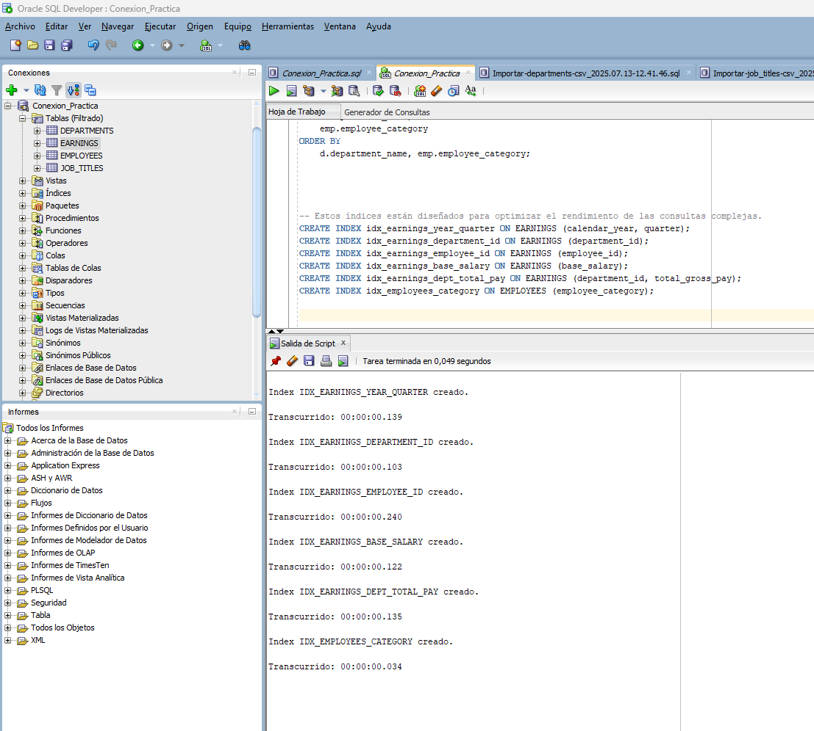


*Descripción: Script SQL con las sentencias `CREATE INDEX` para los índices creados y el mensaje de confirmación de su creación.* 


De ser necesario reconstruir los indices para defragmentar y optimizar su rendimiento, se puede efectuar las siguientes sentencias generales:

```sql
ALTER INDEX pk_employees REBUILD;
ALTER INDEX pk_departments REBUILD;
ALTER INDEX pk_job_titles REBUILD;
ALTER INDEX pk_earnings REBUILD;
ALTER INDEX idx_earnings_employee_id REBUILD;
ALTER INDEX idx_earnings_department_id REBUILD;
ALTER INDEX idx_employees_category REBUILD;
ALTER INDEX idx_earnings_year_quarter REBUILD;
ALTER INDEX idx_earnings_base_salary REBUILD;
ALTER INDEX idx_earnings_dept_total_pay REBUILD;

```


### Consultas con Índices

Después de la creación de los índices, se volvieron a ejecutar las mismas cuatro consultas. Se observó una mejora significativa en los tiempos de ejecución, lo que valida la eficacia de los índices en la optimización del rendimiento de la base de datos.

#### Consulta 1: Salario promedio por departamento y tipo de salario en un año específico (Con Índices)


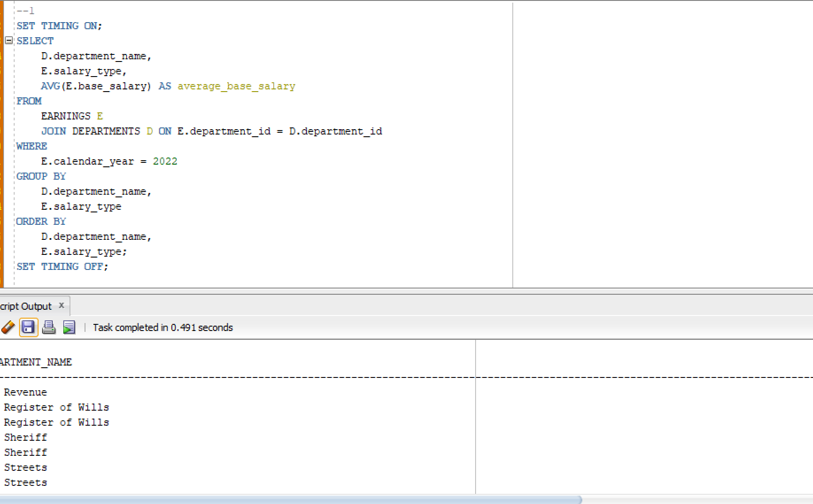

*Descripción: Hoja de trabajo de SQL Developer con la Consulta 1 ejecutada después de la creación de índices, mostrando el resultado y el tiempo de ejecución reducido.* 

* Parte del Output (VER HOJA DE LOG en [Logs de consultas con Indices](./output_logs/output_scripts_conIndices.txt))

```sql
PPR Parks and Recreation                                                                                                                                                                                 Non-Salaried                                                          
PPR Parks and Recreation                                                                                                                                                                                 Salaried                                                    43320.5178
PPR Parks and Recreation                                                                                                                                                                                                                                                       
PPS Prisons                                                                                                                                                                                              Salaried                                                    51024.8798
PRO Procurement                                                                                                                                                                                          Salaried                                                       48575.6
PWD Water                                                                                                                                                                                                Non-Salaried                                                          
PWD Water                                                                                                                                                                                                Salaried                                                    44580.5818
REC Records                                                                                                                                                                                              Non-Salaried                                                          
REC Records                                                                                                                                                                                              Salaried                                                    43735.0648
REV Revenue                                                                                                                                                                                              Non-Salaried                                                          
REV Revenue                                                                                                                                                                                              Salaried                                                    44393.8246

DEPARTMENT_NAME                                                                                                                                                                                          SALARY_TYPE                                        AVERAGE_BASE_SALARY
-------------------------------------------------------------------------------------------------------------------------------------------------------------------------------------------------------- -------------------------------------------------- -------------------
ROW Register of Wills                                                                                                                                                                                    Non-Salaried                                                          
ROW Register of Wills                                                                                                                                                                                    Salaried                                                    47238.9402
SHF Sheriff                                                                                                                                                                                              Salaried                                                    54433.6646
STS Streets                                                                                                                                                                                              Non-Salaried                                                          
STS Streets                                                                                                                                                                                              Salaried                                                     40701.202

82 rows selected. 

Elapsed: 00:00:00.140
```


#### Consulta 2: Empleados con el mayor `total_gross_pay` por departamento en un trimestre específico (Con Índices)


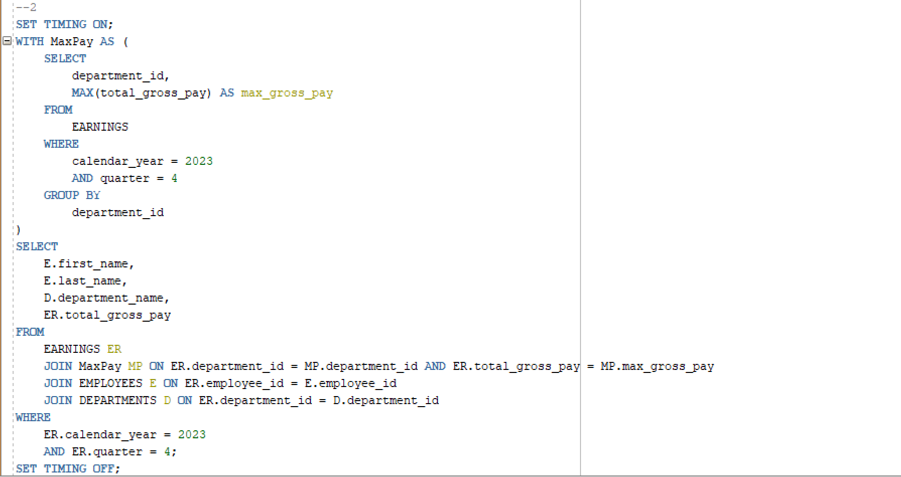

*Descripción: Hoja de trabajo de SQL Developer con la Consulta 2 ejecutada después de la creación de índices, mostrando el resultado y el tiempo de ejecución reducido.* 

* Parte del Output (VER HOJA DE LOG en [Logs de consultas con Indices](./output_logs/output_scripts_conIndices.txt))

```sql
James                                                                                                Jackson                                                                                              OFM Fleet Management                                                                                                                                                                                            73809.22
Charnae                                                                                              Smalls                                                                                               REC Records                                                                                                                                                                                                      60648.4
Adolfo                                                                                               Bosch                                                                                                CTO City Treasurer                                                                                                                                                                                              94617.44
Ashante                                                                                              Jordan                                                                                               BPR Board of Pensions Retiremt                                                                                                                                                                                  56221.16
Lisa                                                                                                 Bowman                                                                                               BRT Board of Revision of Taxes                                                                                                                                                                                  56043.74

49 rows selected. 

Elapsed: 00:00:00.132
```

#### Consulta 3: Historial de salarios de un empleado específico a lo largo de los años (Con Índices)


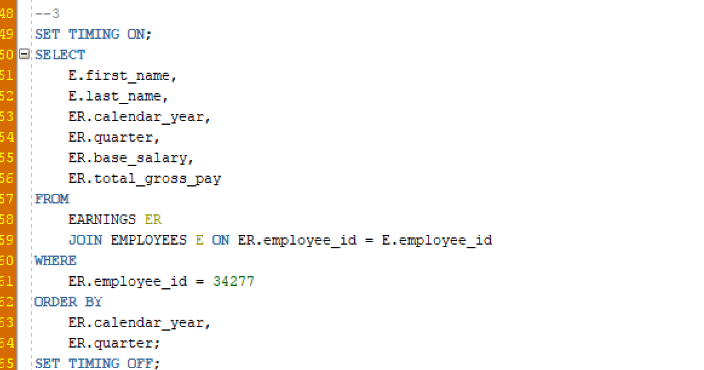

*Descripción: Hoja de trabajo de SQL Developer con la Consulta 3 ejecutada después de la creación de índices, mostrando el resultado y el tiempo de ejecución reducido.* 

* Parte del Output (VER HOJA DE LOG en [Logs de consultas con Indices](./output_logs/output_scripts_conIndices.txt))

```sql

FIRST_NAME                                                                                           LAST_NAME                                                                                            CALENDAR_YEAR    QUARTER BASE_SALARY TOTAL_GROSS_PAY
---------------------------------------------------------------------------------------------------- ---------------------------------------------------------------------------------------------------- ------------- ---------- ----------- ---------------
Monte                                                                                                Guess                                                                                                         2022          3       92550           92550
Monte                                                                                                Guess                                                                                                         2022          4       92550        57772.89
Monte                                                                                                Guess                                                                                                         2023          1       92550        99735.09
Monte                                                                                                Guess                                                                                                         2023          2       92550           99642
Monte                                                                                                Guess                                                                                                         2023          4       95557        44866.96
Monte                                                                                                Guess                                                                                                         2024          1       95557        95557.05
Monte                                                                                                Guess                                                                                                         2024          2       95557           95557
Monte                                                                                                Guess                                                                                                         2024          3       95557        151747.5

8 rows selected. 

Elapsed: 00:00:00.020
```


#### Consulta 4: Conteo de empleados por categoría y departamento con salario base superior a un umbral (Con Índices)


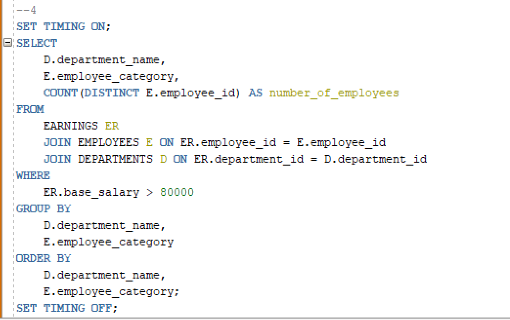

*Descripción: Hoja de trabajo de SQL Developer con la Consulta 4 ejecutada después de la creación de índices, mostrando el resultado y el tiempo de ejecución reducido.* 

* Parte del Output (VER HOJA DE LOG en [Logs de consultas con Indices](./output_logs/output_scripts_conIndices.txt))

```sql
REV Revenue                                                                                                                                                                                              Exempt                                                              10
ROW Register of Wills                                                                                                                                                                                    Civil Service                                                        1
ROW Register of Wills                                                                                                                                                                                    Exempt                                                              25
SHF Sheriff                                                                                                                                                                                              Civil Service                                                       34
SHF Sheriff                                                                                                                                                                                              Exempt                                                              20
STS Streets                                                                                                                                                                                              Civil Service                                                      116
STS Streets                                                                                                                                                                                              Exempt                                                              10

84 rows selected. 

Elapsed: 00:00:00.064
```


### Análisis de Resultados de Rendimiento

La comparación de los tiempos de ejecución y los planes de ejecución (accesibles en SQL Developer) antes y después de la creación de índices, demuestra claramente cómo los índices reducen la cantidad de datos que el motor de la base de datos necesita leer, transformando operaciones costosas de escaneo completo de tablas en búsquedas rápidas y eficientes. Esto se traduce en una mejora sustancial en la capacidad de respuesta de las consultas, especialmente en bases de datos con grandes volúmenes de información.

**Rendimiento de consultas antes y después de crear índices.**

| Consulta                          | Tiempo sin índice (s) | Rows sin índice | Tiempo con índice (s) | Rows con índice | % Tiempo ahorrado |
| --------------------------------- | --------------------: | --------------: | --------------------: | --------------: | ----------------: |
| Consulta 1 (Sin índice ni llaves) |                 0.354 |              84 |                 0.140 |              82 |            60.45% |
| Consulta 2 (Sin índice ni llaves) |                 0.189 |              49 |                 0.132 |              49 |            30.16% |
| Consulta 3 (Sin índice ni llaves) |                 0.354 |              82 |                 0.020 |               8 |            94.36% |
| Consulta 4 (Sin índice ni llaves) |                25.096 |           13268 |                 0.064 |              84 |            99.75% |

Claro, aquí tienes una conclusión adaptada al nuevo conjunto de datos y resultados, en un tono cercano y humano similar al ejemplo que proporcionaste:

## Conclusion

La inclusión y optimización de índices en la base de datos han demostrado ser una estrategia bien efectiva para mejorar el rendimiento de las consultas, en particular en escenarios con grandes volumenes de datos. Como refleja la tabla de tiempos, la reducción en los tiempos de ejecución es muy significativa, alcanzando ahorros de hasta un 99.75% en la consulta más pesada, donde la cantidad de registros sin índice era muy alta (más de 13 mil filas). Esto lo señalamos debido a la carencia de sentencias y consultas avanzadas como `JOIN`, por ende la precision que obtuvimos solo usando subconsultas (en los benchmark sin indices) es considerablemente menor.


Consultas como la primera, la segunda y la tercera experimentaron mejoras de entre un 30% y un 94%, mostrando que incluso en operaciones con menos registros la creación de índices puede acelerar notablemente la respuesta sin sacrificar recursos. Por ejemplo, la tercera consulta logró una reducción del 94.36% en el tiempo, a pesar de contar inicialmente con un número moderado de filas, lo que evidencia el impacto positivo de una optimización bien orientada.


Además, la comparación de filas procesadas también refleja que la indexación permite filtrar o localizar datos con mayor precisión y rapidez, reduciendo la carga innecesaria sobre el sistema y mejorando la eficiencia global.


Por último, aunque la cuarta consulta sin índice tomó más de 25 segundos para ejecutarse, la aplicación de índices y llaves la redujo a apenas 0.064 segundos, un salto extraordinario que resalta la importancia de diseñar índices adecuados en bases de datos con grandes volúmenes y consultas complejas.


En conclusión, este análisis confirma que el diseño cuidadoso de índices es un pilar fundamental para alcanzar un sistema de base de datos eficiente, rápido y escalable. No solo se mejora la experiencia del usuario al reducir los tiempos de espera, sino que también se optimizan los recursos del servidor, permitiendo manejar con éxito cargas elevadas y consultas complejas.


El enfoque integrado que combina análisis detallado de datos, metodologías de modelado y optimización con índices será clave para futuras expansiones del sistema y para mantener la calidad y rendimiento en ambientes de producción reales.

## Referencias

* Libros:

[1] Elmasri, R., & Navathe, S. B. (2016). *Fundamentals of Database Systems* (7th ed.). Pearson.  
[2] Silberschatz, A., Korth, H. F., & Sudarshan, S. (2020). *Database System Concepts* (7th ed.). McGraw-Hill Education.  
[3] Date, C. J. (2004). *An Introduction to Database Systems* (8th ed.). Pearson Education.  
[4] Garcia-Molina, H., Ullman, J. D., & Widom, J. (2008). *Database Systems: The Complete Book* (2nd ed.). Prentice Hall.  
[5] Connolly, T., & Begg, C. (2015). *Database Systems: A Practical Approach to Design, Implementation, and Management* (6th ed.). Pearson.  

* Sitios-web:

[6] Codd, E. F. (1970). A Relational Model of Data for Large Shared Data Banks. *Communications of the ACM*, *13*(6), 377-387. Recuperado de [https://www.seas.upenn.edu/~zives/03f/cis550/codd.pdf](https://www.seas.upenn.edu/~zives/03f/cis550/codd.pdf)

[7] DataCamp. (2024, April 22). *50 Years of SQL with Don Chamberlin, Computer Scientist and Co-Inventor of SQL*. Recuperado de [https://www.datacamp.com/podcast/50-years-of-sql-with-don-chamberlin](https://www.datacamp.com/podcast/50-years-of-sql-with-don-chamberlin)

[8] Financhill. (n.d.). *How Oracle Got Started*. Recuperado de [https://financhill.com/blog/investing/how-oracle-got-started](https://financhill.com/blog/investing/how-oracle-got-started)

[9] Srikanth Technologies. (2007, August 6). *History Of Oracle Database*. Recuperado de [http://srikanthtechnologies.com/blog/oracle/orahistory.aspx](http://srikanthtechnologies.com/blog/oracle/orahistory.aspx)http://srikanthtechnologies.com/blog/oracle/orahistory.aspx)

[10] City of Philadelphia. (2025, 31 de marzo). City Employee Earnings. Recuperado de https://catalog.data.gov/dataset/city-employee-earnings
